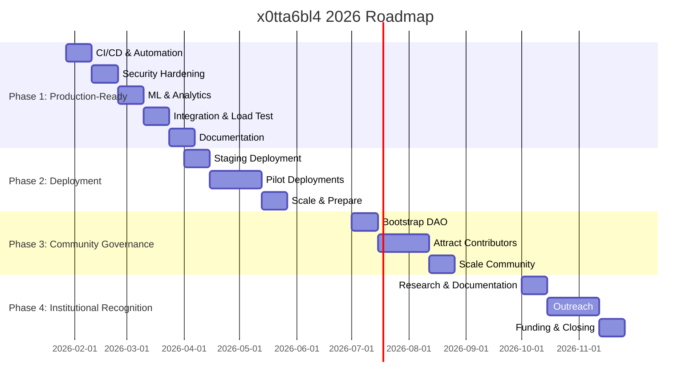

# x0tta6bl4 Project Roadmaps Analysis - 2026

## 📊 Executive Summary

x0tta6bl4 follows a **4-phase synchronized roadmap for 2026** with clear objectives, timelines, and success criteria. The project has completed the initial staging deployment phase and is now focusing on security hardening and beta testing preparation.

## 🎯 Core Roadmap Structure

The **ROADMAP_v3.5_SYNCHRONIZED.md** is the single source of truth for all planning decisions. It unifies 36+ previously contradictory roadmap files into one coherent plan.

### 4-Phase Plan for 2026

| Phase | Duration | Goal | Status |
|-------|----------|------|--------|
| **Phase 1 (Q1)** | Jan 27 - Mar 31, 2026 | Production-ready system | In Progress |
| **Phase 2 (Q2)** | Apr 1 - Jun 30, 2026 | 100-500 nodes across 2-3 countries | Planned |
| **Phase 3 (Q3)** | Jul 1 - Sep 30, 2026 | Community governance with 50+ contributors | Planned |
| **Phase 4 (Q4)** | Oct 1 - Dec 31, 2026 | Institutional recognition and funding | Planned |

## 🚀 Phase 1: Production-Ready (Q1 2026)

### Key Focus Areas

#### Week 1-2: CI/CD & Automation (CRITICAL)
- GitHub Actions workflow with automated releases
- Docker build & push automation
- PyPI auto-publishing
- One-click deployment
- Semantic versioning
- Release notes auto-generation

#### Week 3-4: Security Hardening
- SPIFFE/SPIRE production-ready (7→9/10)
- mTLS for all connections (6→9/10)
- External security audit
- GDPR/SOC2 compliance checks
- Post-quantum crypto integration (ML-KEM-768, ML-DSA-65)
- Key rotation automation

#### Week 5-6: ML & Analytics
- GraphSAGE causal analysis complete
- RAG pipeline MVP
- Anomaly detection tuning
- Benchmark validation
- Causal Analysis Engine improvements

#### Week 7-8: Integration & Load Testing
- End-to-end scenarios (10+ workflows)
- Load testing (1,000+ concurrent)
- Chaos engineering tests
- Stability validation (30+ days)
- Performance profiling under load

#### Week 9-10: Documentation & Hardening
- Full API documentation
- Deployment guides
- Operations manual
- SLA/SLO definition
- Developer guides
- Architecture diagrams

## 🛡️ Security Hardening Roadmap

**Current Status:** 3.5/10 → Target: 7.5/10 (by Feb 1, 2026)

### Phase 1 (P0 - Critical): Jan 18-21, 2026
1. ✅ Post-quantum module import fix
2. 🔄 Password hashing (SHA-256 → bcrypt)
3. 🔄 API keys exposed in responses
4. 🔄 Flask SECRET_KEY configuration
5. 🔄 Insecure password comparison
6. 🔄 Missing rate limiting
7. 🔄 Missing admin endpoint authentication
8. 🔄 Pickle deserialization (RCE risk)

### Phase 2 (P1 - High): Jan 22-25, 2026
- CI/CD fixes (remove `|| true`)
- Read-only root filesystem
- Disable public EKS access
- Commit hash in Dockerfile
- Dependency version unification
- Vulnerable dependency updates
- Terraform state encryption
- Subprocess call validation
- Security headers

### Phase 3 (P2 - Medium): Jan 26-28, 2026
- ResourceQuota enforcement
- External Secrets management
- Network policies
- CSRF protection
- Security headers
- PostgreSQL migration

### Phase 4 (P3 - Low): Jan 29-31, 2026
- Real metrics validation
- Test coverage improvement (4.86% → 25%)
- Type hints
- Pre-commit hooks
- Integration tests
- Dockerfile HEALTHCHECK

## 🧪 Beta Testing Roadmap (Q1-Q2 2026)

### Timeline
- **Week 1-2 (Mar):** Internal beta (5-10 testers)
- **Week 3-8 (Mar-Apr):** External beta (20-50 testers)
- **Week 9-12 (Apr-May):** Feedback analysis and improvements

### Success Criteria
- 20+ active beta testers
- System stable for 30+ days
- <1% error rate
- <500ms p95 latency
- Positive feedback from 80%+ testers

## 🚀 Commercial Launch Roadmap (Q3 2026)

### Pre-Launch Preparation (Q2 2026)
- SSO Integration (SAML 2.0, OAuth 2.0)
- SCIM Implementation (user provisioning)
- Deep RBAC (fine-grained permissions)
- Billing System (Stripe/Paddle)
- Customer Portal (self-service)
- Support System (ticketing, knowledge base)

### Pricing Tiers
| Tier | Nodes | Support | Price |
|------|-------|---------|-------|
| Free | Up to 5 | Community | $0 |
| Professional | Up to 50 | Email | $99/month |
| Business | Up to 500 | Priority | $499/month |
| Enterprise | Unlimited | Dedicated | Custom ($150K+/year) |

### Revenue Targets
- Q3 2026: $100K MRR, 100+ paying customers
- Q4 2026: $200K MRR, 400+ customers
- 2026 Total: $750K-$1.6M

## 💸 Financial Projections (Conservative)

### Investment Required
- **Q1 2026:** $360K (6 engineers × $5K/week × 10 weeks)
- **Q2-Q4 2026:** $0 (operational costs from revenue)
- **Total 2026:** $360K

### Revenue Forecast
| Period | Low | High |
|--------|-----|------|
| Q1 2026 | $0 | $0 |
| Q2 2026 | $50K | $100K |
| Q3 2026 | $200K | $500K |
| Q4 2026 | $500K | $1M |
| **Total 2026** | **$750K** | **$1.6M** |

## 📊 Key Metrics & SLOs

### Technical SLOs
- **Uptime:** >99%
- **MTTR:** <10 minutes
- **P95 Latency:** <200ms
- **Error Rate:** <1%
- **Test Coverage:** >90%

### Business Metrics
| Metric | Q1 | Q2 | Q3 | Q4 |
|--------|----|----|----|----|
| Nodes | 0 | 100-500 | 500-1K | 1K+ |
| Users | 0 | 1K+ | 5K+ | 10K+ |
| Revenue | $0 | $50-100K | $200-500K | $500K-1M |
| Contributors | 10 | 20 | 50+ | 100+ |
| Countries | 0 | 2-3 | 3-5 | 5+ |

## 🚨 Risks & Mitigation

### Critical Risks
1. **Security audit delays:** Start early, use known auditor, buffer time
2. **Team attrition:** Equity + bonuses, clear career path
3. **Deployment issues:** Staging first, gradual rollout, rollback plan
4. **Regulatory blockers:** Legal review early, compliance checks
5. **Technical complexity:** Phased approach, MVP first, iterate

### Mitigation Actions
- Weekly checkpoint meetings (Mondays 10:00 UTC)
- Daily standup + metrics tracking
- 10% contingency budget ($36K)
- Clear escalation paths
- Monthly risk assessment

## 🎯 Strategic Focus After Staging Deployment

Now that the staging deployment is successful, the immediate focus should be:

1. **Complete security hardening** (Phase 1-4 by Feb 1, 2026)
2. **Prepare for beta testing** (internal beta in March 2026)
3. **Continue CI/CD automation** (Week 1-2 of Phase 1)
4. **Collect user feedback** from customer1 (Jan 21 feedback call)
5. **Validate P0 components** in staging environment

## 📈 Impact-Effort Matrix for Prioritization

### High Impact, Low Effort (Quick Wins)
- ✅ Post-quantum module import fix
- ✅ Flask SECRET_KEY configuration
- ✅ Insecure password comparison
- 🔄 API keys exposed in responses

### High Impact, High Effort (Strategic)
- 🔄 Password hashing upgrade (bcrypt)
- 🔄 Rate limiting implementation
- 🔄 Admin endpoint authentication
- 🔄 Pickle deserialization fix

### Low Impact, Low Effort (Cosmetic)
- Pre-commit hooks
- Type hints
- Dockerfile HEALTHCHECK

### Low Impact, High Effort (Future)
- Full PostgreSQL migration
- External Secrets management
- Advanced network policies

## 🗓️ Gantt Diagram (Simplified)

## 📝 Conclusion

The x0tta6bl4 project has a **well-structured, synchronized roadmap** for 2026 with clear phases, timelines, and success criteria. The immediate focus is on completing the security hardening phase (by Feb 1, 2026) and preparing for beta testing in March 2026.

The project has already achieved a significant milestone with the successful staging deployment, and the security hardening roadmap provides a clear path to improve the system's security posture.

Key strengths of the roadmap:
- **Realistic timelines** based on 6-engineer team capacity
- **Conservative financial projections** ($360K investment, $750K-$1.6M revenue)
- **Clear prioritization** of security and reliability
- **Phased approach** to minimize risk

With focused execution on the security hardening phase, x0tta6bl4 is on track to achieve production readiness by the end of Q1 2026.
