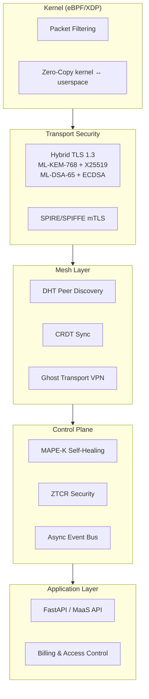

# x0tta6bl4 — Self-Healing Mesh Networking Platform

[](LICENSE)
[](https://github.com/x0tta6bl4-ai/x0tta6bl4/security/code-scanning)


[](https://github.com/x0tta6bl4-ai/x0tmq)

**Post-quantum cryptography · eBPF/XDP kernel dataplane · Autonomous self-healing**  
Independent engineering research project by [x0tta6bl4](https://github.com/x0tta6bl4-ai).  
*AI-assisted: see [AI-DECLARATION.md](AI-DECLARATION.md) and [system prompts](/.prompts/).*

---

> **🇬🇧 English.** [🇷🇺 Русская версия](docs/ru/README.md)

---

## What is this?

An **independent engineering research project** exploring post-quantum mesh networking:

- **Post-quantum cryptography** — ML-KEM-768/1024 + ML-DSA-65/87 (FIPS 203/204)
- **eBPF/XDP dataplane** — Kernel-level packet filtering and forwarding
- **Autonomous MAPE-K control loop** — Self-healing infrastructure
- **SPIRE/SPIFFE** — Zero-trust identity for mesh nodes
- **[x0tMQ](https://github.com/x0tta6bl4-ai/x0tmq)** — Post-quantum MAVLink v2 authentication standard (IETF Draft)

**Live infrastructure:** NL VPS (89.125.1.107) — SPIRE server + 2 mesh nodes + Ghost VPN

## Honest Status

| Statement | Reality |
|-----------|---------|
| Production deployments | ❌ None. Experimental codebase |
| SLA / commercial support | ❌ Solo project, no SLA |
| Audited cryptography | ❌ Integration-level only (liboqs) |
| Community governance | ❌ Solo project |
| Code compiles + tests pass | ✅ 215/240 (PQC, MAPE-K, ZTCR, eBPF) |
| CI/CD active | ✅ CodeQL, Bandit, Docker builds |
| Live VPS infra | ✅ NL VPS: SPIRE + mesh × 2 + Ghost VPN |

## Quick Start

```bash
git clone https://github.com/x0tta6bl4-ai/x0tta6bl4.git
cd x0tta6bl4
uv sync

# Local mesh (SPIRE + 2 nodes)
docker compose -f deploy/docker-compose/compose.yaml up -d
curl -s http://localhost:9100/health
```

[Full docs →](docs/) | [x0tMQ standard →](https://github.com/x0tta6bl4-ai/x0tmq) | [Telegram](https://t.me/x0tta6bl4_ai) | [Issues](https://github.com/x0tta6bl4-ai/x0tta6bl4/issues)

---

## Architecture



## Components

| Component | Lang | Lines | Status |
|-----------|------|-------|--------|
| PQC (ML-KEM-768/1024 + ML-DSA-65/87) | Python | ~3,500 | ✅ Tested via liboqs |
| MAPE-K self-healing loop | Python | ~1,900 | ✅ 4/4 tests |
| MaaS API (REST, FastAPI) | Python | ~5,000 | ✅ 35+ handlers |
| eBPF/XDP dataplane | C | ~1,500 | ✅ Kernel-level |
| Anti-censorship / DPI bypass | Python/Sh | ~2,000 | ✅ Reality + XHTTP |
| Ghost Transport VPN | Python | ~2,000 | ✅ Docker-ready |
| Billing & Access | Python | ~1,200 | ✅ Subscription model |
| **x0tMQ** (MAVLink PQC) | Python | ~775 | ✅ [IETF Draft](https://github.com/x0tta6bl4-ai/x0tmq) |

## Benchmarks

| Metric | Value | Conditions |
|--------|-------|------------|
| XDP TX throughput | 141,667 PPS | pktgen → XDP_TX |
| XDP RX throughput | 49,000 PPS | XDP_DROP raw |
| PQC hybrid handshake | <50 ms | ML-KEM-768 + ML-DSA-65, localhost |
| MAPE-K MTTD | <20 s | Time to detect anomaly |
| MAPE-K MTTR | ~3 min | Autonomous recovery |
| Dependencies | 376 (lock file) | Python |

## Security

- **CodeQL**: 30 open alerts (4 error, 26 warning) — being triaged
- **Bandit**: 0 HIGH, 0 CRITICAL
- **Dependabot**: Auto-patches active
- **CVE fixes**: 8 (eBPF, Domain Fronting, PQC, SPIFFE)
- **ZTCR chaos tests**: 29 scenarios

## Languages

Python 71.8% · C 19.8% · Shell 4.1% · Go 1.2% · HTML 1% · TS/JS 0.8% · others 1.3%

**1,085 commits · 4,736 source files · 352 MB**

---

*Independent engineering project. Verified by machines, not marketing.*

---

## 🇷🇺 Русская версия

Полная русская версия: [`docs/ru/README.md`](docs/ru/README.md)