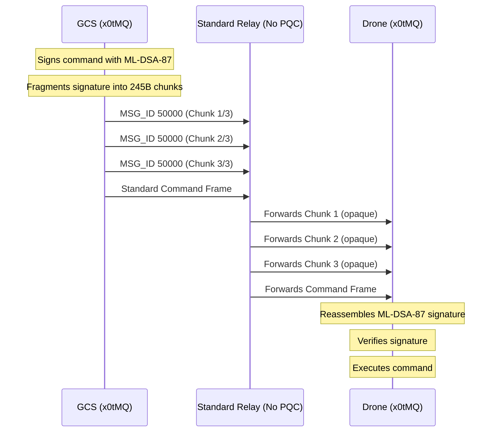

# x0tMQ
### Relay-Transparent Post-Quantum Authentication for MAVLink v2

**Status:** Internet-Draft (Standards Track) · Expires: December 2026

[IETF Draft](/docs/rfc/draft-x0tmq-mavlink-pqc.md) · [RFC](#) · [Benchmarks](#benchmarks) · [Contact](mailto:x0tta6bl4.ai@gmail.com)

---

## The Problem

MAVLink v2 — the standard protocol for UAVs, ground stations, and robotics — signs packets with **HMAC-SHA256** using a pre-shared key. This means:

- **No forward secrecy** — a captured key decrypts all past traffic
- **No asymmetric authentication** — commands can't be bound to a specific originator
- **HNDL vulnerability** — "Harvest Now, Decrypt Later" with a quantum computer

Bolting on post-quantum signatures (ML-DSA) directly breaks standard relays — they discard trailing authentication bytes as malformed garbage.

## The Solution: X0TMQ_CHUNK

Instead of appending signatures to existing frames, x0tMQ **fragments** the PQ payload into 245-byte chunks. Each chunk is a perfectly valid, standalone MAVLink v2 frame that passes transparently through legacy infrastructure.



### Why this works

| Property | Standard MAVLink | x0tMQ |
|----------|-----------------|----------|
| Relay compatibility | ✅ Forwarded | ✅ Forwarded (opaque valid frames) |
| Asymmetric auth | ❌ HMAC only | ✅ ML-DSA-87 (FIPS 204) |
| Forward secrecy | ❌ | ✅ ML-KEM-1024 (FIPS 203) |
| Quantum-safe | ❌ | ✅ NIST Category 5 |
| Per-packet overhead | 16 bytes HMAC | 32 bytes HMAC-SHA3-256 |
| Overhead per critical cmd | N/A | ~2.4 KB (fragmented) |

---

## Protocol Messages

| MSG_ID | Name | Purpose |
|--------|------|---------|
| 50000 | `X0TMQ_CHUNK` | 245-byte fragment of a PQ payload |
| 50001 | `X0TMQ_SESSION_INIT` | ML-KEM-1024 ciphertext + session ID |
| 50002 | `X0TMQ_SIGNED_CMD` | ML-DSA-87 signature over a command |

### X0TMQ_CHUNK Frame Structure

```
Offset  Size  Field
------  ----  -----
0       2     src_msgid        (original message ID being fragmented)
2       2     chunk_idx        (zero-based chunk index)
4       2     total_chunks     (max: 1024)
6       245   payload          (chunk data)
251     2     crc16            (CRC-16-CCITT over payload[0..250])
```

**Total:** 253 bytes — fits comfortably within MAVLink v2 MTU.

---

## Cryptographic Profile

| Algorithm | Standard | Role | Latency (ARM64 Neoverse-N2) | Payload |
|-----------|----------|------|----------------------------|---------|
| ML-KEM-1024 | FIPS 203 | Session key encapsulation | **241 μs** (one-shot) | 1568 B ciphertext |
| ML-DSA-87 | FIPS 204 | Command signing | **509 μs** sign · ~480 μs verify | ~2429 B signature |
| HMAC-SHA3-256 | NIST | Per-packet auth | **1.1 μs** (continuous) | 32 B per packet |

### Session Lifecycle

```
┌─────────────────────────────────────────────────────────┐
│  Phase 1: Session Establishment                          │
│  GCS → UAV: X0TMQ_SESSION_INIT (ML-KEM-1024 ct)      │
│  UAV: Decapsulates → HKDF → K_cmd, K_auth, K_enc        │
│  UAV → GCS: X0TMQ_SESSION_ACK                         │
├─────────────────────────────────────────────────────────┤
│  Phase 2: Normal Operation                               │
│  Telemetry: HMAC-SHA3-256 (K_auth) — 1.1 μs/pkt         │
│  Critical Cmd: ML-DSA-87 (K_cmd) — 509 μs/cmd           │
├─────────────────────────────────────────────────────────┤
│  Phase 3: Re-key (every 15 min or 100k packets)          │
│  GCS → UAV: New X0TMQ_SESSION_INIT                   │
└─────────────────────────────────────────────────────────┘
```

---

## Benchmarks

Measured on **ARM64 Neoverse-N2** @ 2.8 GHz (liboqs reference implementation):

| Operation | Time | Scenario |
|-----------|------|----------|
| ML-KEM-1024 Encaps | **241 μs** | Once per flight session |
| ML-KEM-1024 Decaps | **241 μs** | Once per flight session |
| ML-DSA-87 Sign (256 B) | **509 μs** | Per critical command |
| ML-DSA-87 Verify (256 B) | ~**480 μs** | Onboard FCS |
| HMAC-SHA3-256 (32 B) | **1.1 μs** | Per telemetry packet (100 Hz+) |
| X0TMQ_CHUNK fragment | <**10 μs** | Per chunk (zero-copy) |
| Reassembly + CRC verify | <**5 μs** | Per chunk |

These are **reference implementation** numbers. Optimized assembly or hardware-accelerated crypto (ARM Crypto Extensions, TPM) improves by 2-5x.

---

## Relay-Striping Attack Mitigation

A malicious relay can't strip auth data because:

1. **Each chunk is a valid MAVLink frame** with its own CRC. Relay sees no reason to drop it.
2. **Missing chunks detected at receiver** — CRC fails on reassembly if any chunk is missing.
3. **Out-of-order chunks rejected** — seq ordering in MAVLink header.

Standard relays forward X0TMQ_CHUNK frames as opaque valid traffic. No modification to relay infrastructure required.

---

## Hybrid Transition (Pre-2028)

During the CNSA 2.0 transition window, implementations MAY dual-sign commands:

```
ML-DSA-44  (2.4 KB, Category 2)  →  for PQ-capable receivers
HMAC-SHA256 (32 B)                →  for legacy compatibility
```

Receivers accept either signature as valid until a configurable cutoff date.

---

## Getting Started

### Clone & Explore

```bash
git clone https://github.com/x0tta6bl4-ai/x0tta6bl4
cd x0tta6bl4
```

### Read the Draft

Full specification: [`docs/rfc/draft-x0tmq-mavlink-pqc.md`](https://github.com/x0tta6bl4-ai/x0tta6bl4/blob/main/docs/rfc/draft-x0tmq-mavlink-pqc.md)

### Reference Implementation

Main code: [`src/security/x0tmq/`](https://github.com/x0tta6bl4-ai/x0tta6bl4/tree/main/src/security/x0tmq)

| Module | File | Lines | Role |
|--------|------|-------|------|
| PQC core (ML-KEM-1024) | `src/network/firstparty_vpn/mlkem.py` | 899 | FIPS 203 keygen, encaps, decaps |
| PQC core (ML-DSA-87) | `src/network/firstparty_vpn/mldsa.py` | 1440 | FIPS 204 keygen, sign, verify |
| Frame codec | `src/security/x0tmq/frame.py` | ~120 | MAVLink v2 framing + CRC-16-CCITT |
| Chunking | `src/security/x0tmq/chunk.py` | ~130 | X0TMQ_CHUNK frag/defrag |
| Session manager | `src/security/x0tmq/session.py` | ~250 | SESSION_INIT + SIGNED_CMD + HMAC |

### Run Tests

```bash
# Verify ML-KEM-1024 implementation
python3 -c "from src.network.firstparty_vpn.mlkem import mlkem_encapsulate, mlkem_keygen; print('ML-KEM OK')"

# Verify ML-DSA-87 signing flow
python3 -c "from src.network.firstparty_vpn.mldsa import mldsa_reference_sign, mldsa_derive_reference_keypair; print('ML-DSA OK')"

# Simulate X0TMQ_CHUNK relay-transparent fragmentation
python3 -c "
from src.security.x0tmq import CleitonqChunker
c = CleitonqChunker(1, 1)
frames = c.fragment(42, b'hello' * 100)
print(f'Fragmented into {len(frames)} frames')
reassembled = frames[0]  # must feed all
for f in frames:
    r = c.process_chunk(f)
    if r: print(f'Reassembled: {len(r)}B OK')
"
```

---

## License

The x0tMQ specification (IETF draft) is licensed under [CC-BY-4.0](LICENSE).  
Reference implementations are licensed under [Apache-2.0](LICENSE-CODE).

---

## Author

**x0tta6bl4** · [GitHub](https://github.com/x0tta6bl4-ai) · [Proton](mailto:x0tta6bl4.ai@gmail.com)

*Security researcher, systems engineer. Author of the x0tta6bl4 Zero-Trust mesh platform and NIST PQC integration for constrained UAV networks.*
