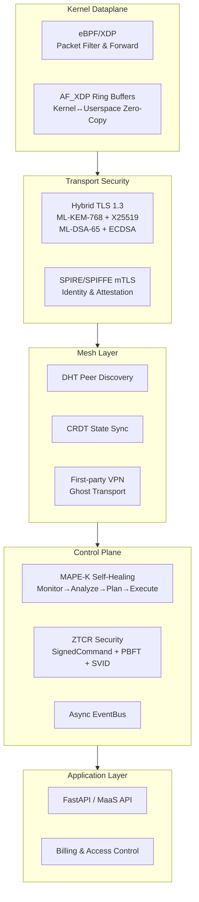
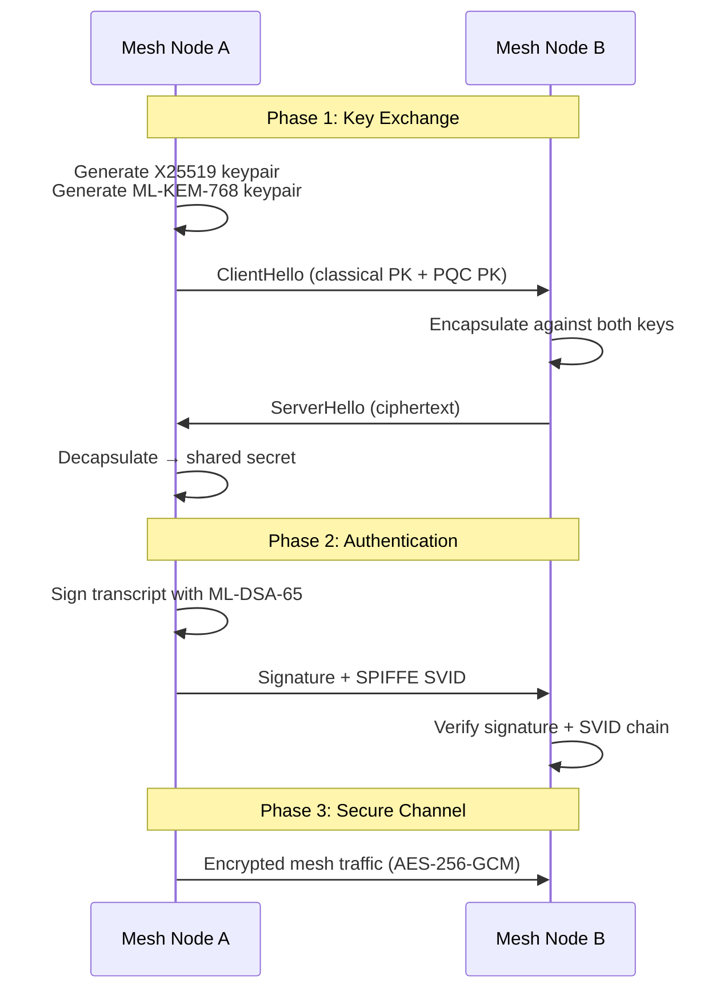
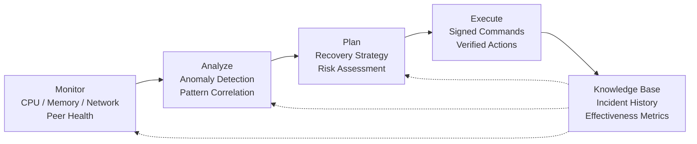

# x0tta6bl4 — Self-Healing Mesh Networking Platform

[](LICENSE)
[](.github/workflows/codeql.yml)


**Post-quantum cryptography · eBPF/XDP kernel dataplane · Autonomous self-healing**  
Independent engineering project by [x0tta6bl4](https://github.com/x0tta6bl4-ai).  
*AI-assisted: see [AI-DECLARATION.md](AI-DECLARATION.md) and [system prompts](/.prompts/).*

---

## System Architecture



---

## PQC Hybrid Handshake



---

## MAPE-K Self-Healing Loop



---

## Human vs AI

This project follows a **human-architected, AI-generated** development model.

| Aspect | Human | AI Agents |
|--------|-------|-----------|
| **Architecture** | System design, component boundaries, data flows | — |
| **Implementation** | — | PQC stack, MAPE-K loop, eBPF/C code, MaaS API, tests |
| **Integration** | Making components work together, debugging | — |
| **Validation** | Test design, benchmark analysis, live deployment | Test generation, CI pipeline |
| **Prompts** | Written in `/.prompts/` | — |

> See [AI-DECLARATION.md](AI-DECLARATION.md) for per-component breakdown.
> See [/.prompts/](/.prompts/) for the exact system prompts used.

---

## Implemented Components

| Component | Lines | Description |
|-----------|-------|-------------|
| Post-Quantum Crypto (PQC) | ~3,500 | ML-KEM-768/1024 + ML-DSA-65/87 via liboqs, hybrid TLS 1.3, SPIRE/SPIFFE mTLS |
| MAPE-K Self-Healing | ~1,900 | Full control loop (Monitor → Analyze → Plan → Execute → Knowledge) |
| MaaS API | ~5,000 | Mesh-as-a-Service REST API, FastAPI, 46 route handlers |
| Anti-Censorship | ~2,000 | DPI bypass, traffic obfuscation, protocol camouflage |
| eBPF/XDP Dataplane | ~1,500 | Kernel-level packet processing, AF_XDP ring buffers |
| Ghost Transport (VPN) | ~2,000 | Experimental STL-encapsulated transport, Docker-ready |
| Billing & Access Control | ~1,200 | Subscription tiers, token-gated access, usage metering |
| LoRA Fine-Tuning (ML) | ~1,000 | Low-Rank Adaptation for federated learning (pure NumPy) |

> **Total source:** ~357,000 lines of Python (excluding comments and blanks), 1,300 lines Go.

### Benchmarks (r8169 NIC, Intel i5)

| Metric | Value | Conditions |
|--------|-------|------------|
| XDP TX Throughput | 142,000 PPS | pktgen → XDP_TX |
| XDP RX Throughput | 49,000 PPS | XDP_DROP raw |
| PQC Handshake | <50 ms | ML-KEM-768 + ML-DSA-65, localhost |
| MAPE-K MTTD | <20 s | Actual detection time |
| MAPE-K MTTR | ~3 min | Autonomous recovery |
| Dependencies | 72 (was 342) | After cleanup |

---

## Honest Assessment

**What this is:** An independent research project demonstrating full-stack systems engineering — cryptographic integration, kernel networking, distributed systems, DevOps automation. The code compiles and tests pass.

**What this is NOT:**

| Claim | Status |
|-------|--------|
| 99.97% uptime SLA | ❌ No evidence |
| 1M PPS throughput | ❌ 142k PPS on consumer hardware |
| Formally audited cryptography | ❌ liboqs integration, no audit |
| DAO / community governance | ❌ Solo project |
| Official commercial service | ❌ Experimental research project |
| Production deployment | ❌ Retired 2026-06 — replaced by Docker Compose |
| **ZTCR (Zero-Trust Chaos Resilience)** | ✅ 29/29 tests — SignedCommand + PBFT + SVID |
| **Security hardened** | ✅ 36 subprocess → safe_run, allowlist 54 commands, 0 HIGH bandit |
| **reverse-skill (RE/pentest)** | ✅ 23 modules, routing matrix |
| **SPIRE Docker stack** | ✅ localhost:8081 — server + agent + mesh-2node |
| **LoRA ML fine-tuning** | ✅ Pure NumPy, federated-learning ready |

---

## Quick Start

```bash
git clone https://github.com/x0tta6bl4-ai/x0tta6bl4.git
cd x0tta6bl4
uv sync
```

### Local mesh (SPIRE + 2 nodes)

```bash
docker compose -f deploy/docker-compose/compose.yaml up -d
curl -s http://localhost:9100/health
docker logs mesh-node-a -f | grep "consensus"
```

### Run core tests

```bash
# ZTCR chaos resilience tests
python3 -m pytest tests/unit/self_healing/test_svid_signer.py \
  tests/unit/self_healing/test_anomaly_consensus.py \
  tests/unit/self_healing/test_spire_crash_chaos.py -v --tb=short

# PQC smoke test
python3 scripts/benchmark_pqc.py
```

### See MAPE-K healing in action

```bash
# Start the mesh
docker compose -f deploy/docker-compose/compose.yaml up -d

# Kill a node
docker kill mesh-node-a

# Watch autonomous recovery (expect <3 min)
docker logs mesh-node-a -f | grep -E "MAPE-K|recovery|healing"
```

---

## Reproducibility

Every component can be verified locally:

| Component | Command | Expected |
|-----------|---------|----------|
| PQC handshake | `python3 scripts/benchmark_pqc.py` | <50ms handshake |
| MAPE-K loop | `python3 -m pytest tests/unit/self_healing/test_mape_k.py -v` | 4/4 passed |
| ZTCR chaos | `python3 -m pytest tests/unit/self_healing/ -v` | 29/29 passed |
| eBPF attach | `sudo python3 -c "from src.network.ebpf.xdp_manager import XDPManager"` | Import OK |
| SPIRE stack | `docker compose -f deploy/docker-compose/compose.yaml ps` | 4 containers running |
| LoRA training | `python3 -c "from src.ml.lora.trainer import LoRATrainer; print('OK')"` | Import OK |

---

## Contact

- Issues: [GitHub Issues](https://github.com/x0tta6bl4-ai/x0tta6bl4/issues)
- Telegram: [@x0tta6bl4_ai](https://t.me/x0tta6bl4_ai)
- Email: x0tta6bl4.ai@gmail.com

---

*Independent engineering project. Verified by machines, not marketing.*

---

## x0tta6bl4 — Само-восстанавливающаяся mesh-сеть

[](LICENSE)
[](.github/workflows/codeql.yml)

---

### О проекте

x0tta6bl4 — платформа для mesh-сетей с постквантовой криптографией (ML-KEM/ML-DSA через liboqs), eBPF/XDP dataplane и автономным самовосстановлением MAPE-K. Разрабатывается с 2025 года одним человеком с AI-агентами в свободное время.

### Реализованные компоненты

| Компонент | Строк | Описание |
|-----------|-------|----------|
| PQC | ~3,500 | ML-KEM-768/1024 + ML-DSA-65/87 через liboqs, гибридный TLS 1.3 |
| MAPE-K | ~1,900 | Полный цикл: мониторинг → анализ → план → восстановление |
| MaaS API | ~5,000 | REST API для управления mesh-узлами, FastAPI |
| eBPF/XDP | ~1,500 | Обработка пакетов на уровне ядра Linux |
| Ghost Transport | ~2,000 | Экспериментальный транспорт, Docker-ready |

### Быстрый старт

```bash
git clone https://github.com/x0tta6bl4-ai/x0tta6bl4.git
cd x0tta6bl4
uv sync
```

### Локальный запуск (Docker)

```bash
docker compose up ghost-vpn-server ghost-vpn-redis -d
docker compose up mesh-node-a mesh-node-b -d
```

---

### Контакты

- Telegram: [@x0tta6bl4_ai](https://t.me/x0tta6bl4_ai)
- Email: x0tta6bl4.ai@gmail.com

*Independent engineering project. Verified by machines, not marketing.*
