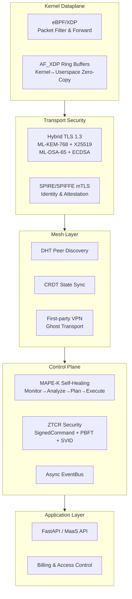
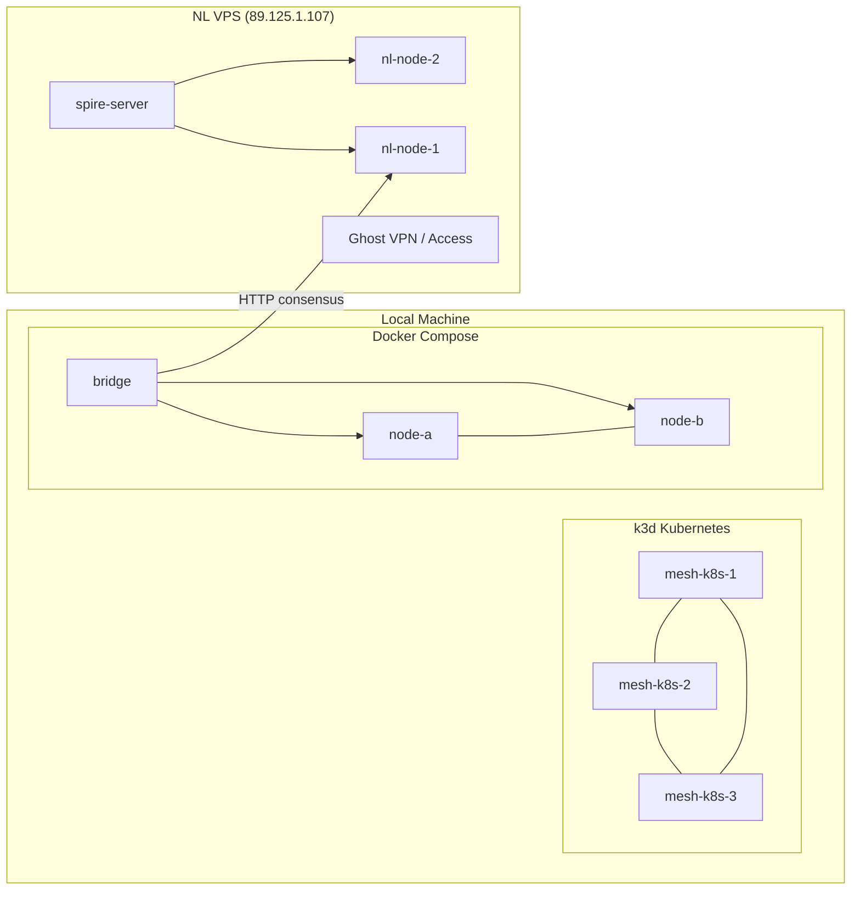
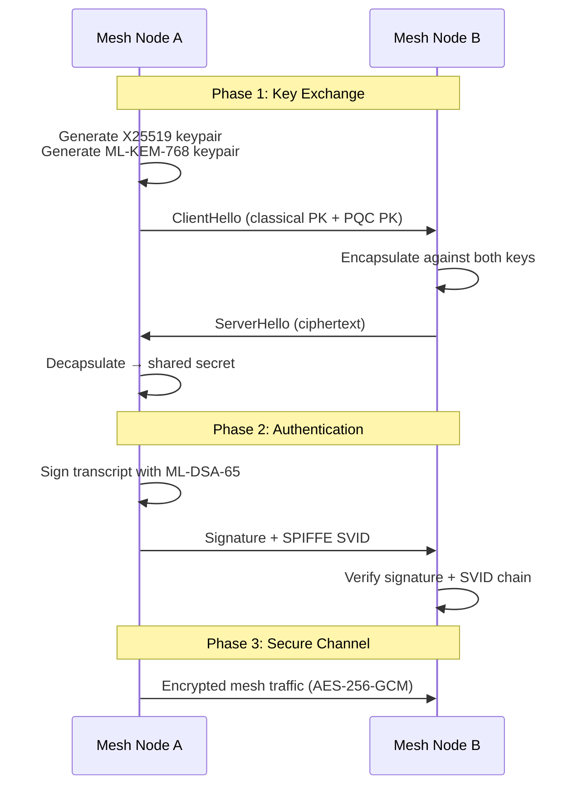
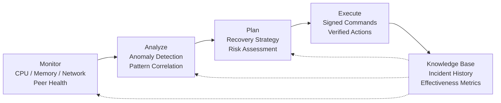
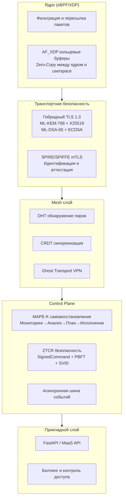
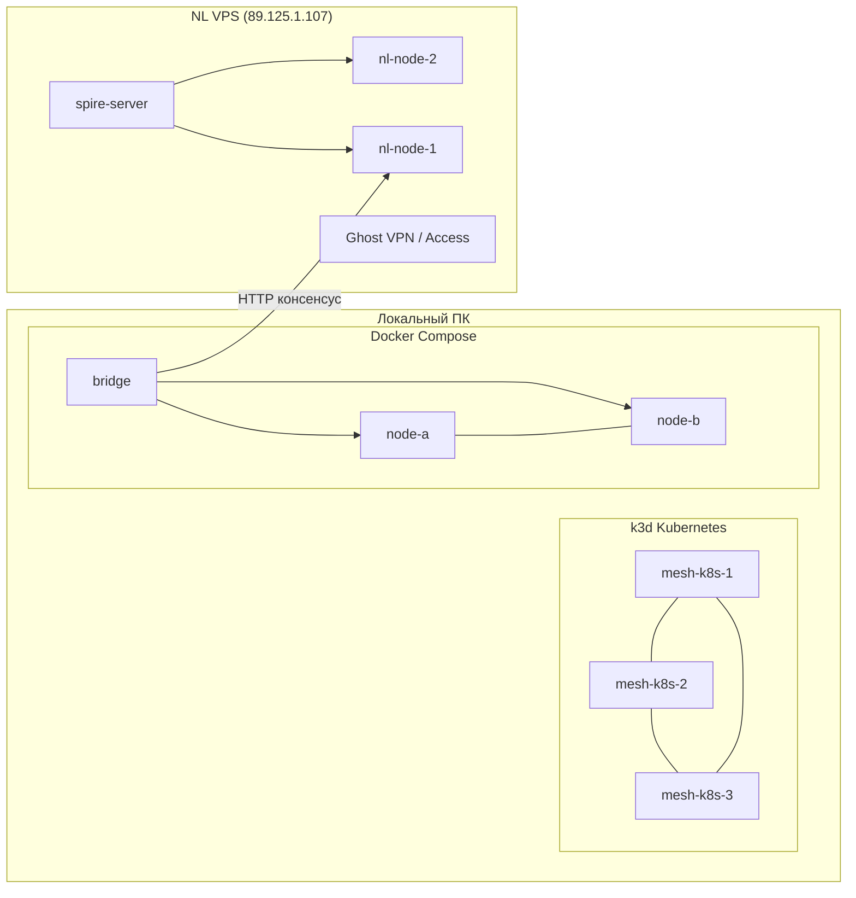
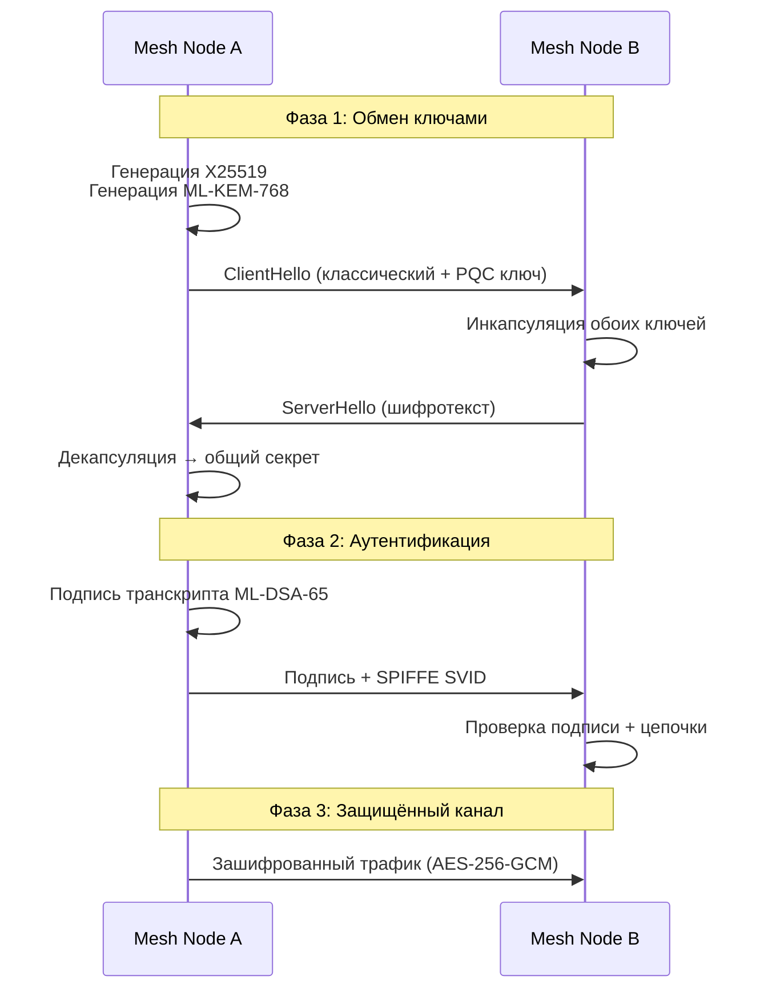
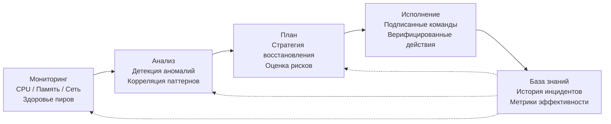

# x0tta6bl4 — Self-Healing Mesh Networking Platform

[](LICENSE)
[](.github/workflows/codeql.yml)


**Post-quantum cryptography · eBPF/XDP kernel dataplane · Autonomous self-healing**  
Independent engineering project by [x0tta6bl4](https://github.com/x0tta6bl4-ai).  
*AI-assisted: see [AI-DECLARATION.md](AI-DECLARATION.md) and [system prompts](/.prompts/).*

---

## System Architecture



---

## Infrastructure (Live — June 2026)



| Component | Location | Status | Notes |
|-----------|----------|--------|-------|
| **NL VPS** (89.125.1.107) | Netherlands | ✅ Production | SPIRE, mesh-node ×2, Ghost VPN, x-ui |
| **Docker Compose** | Local | ✅ Running | mesh-node-a/b + bridge → NL |
| **k3d K8s Cluster** | Local | ✅ Running | 3 nodes (k3s v1.31.5), mesh consensus |
| **SPIRE Server** | NL + Docker | ✅ Active | Trust domain: x0tta6bl4.mesh |
| **Health Monitor** | Cronjob | ✅ Every 5min | 10 services + 2 mesh nodes checked |
| **CVE Monitor** | Cronjob | ✅ Daily 6:00 | Dependabot tracking, auto-patch |
| **GitMark RAG** | Cronjob | ✅ Daily 5:00 | Codebase knowledge base rebuild |

---

## PQC Hybrid Handshake



---

## MAPE-K Self-Healing Loop



---

## Human vs AI

This project follows a **human-architected, AI-generated** development model.

| Aspect | Human | AI Agents |
|--------|-------|-----------|
| **Architecture** | System design, component boundaries, data flows | — |
| **Implementation** | — | PQC stack, MAPE-K loop, eBPF/C code, MaaS API, tests |
| **Integration** | Making components work together, debugging | — |
| **Validation** | Test design, benchmark analysis, live deployment | Test generation, CI pipeline |
| **Prompts** | Written in `/.prompts/` | — |

> See [AI-DECLARATION.md](AI-DECLARATION.md) for per-component breakdown.
> See [/.prompts/](/.prompts/) for the exact system prompts used.

---

## Implemented Components

| Component | Lines | Description |
|-----------|-------|-------------|
| Post-Quantum Crypto (PQC) | ~3,500 | ML-KEM-768/1024 + ML-DSA-65/87 via liboqs, hybrid TLS 1.3, SPIRE/SPIFFE mTLS |
| MAPE-K Self-Healing | ~1,900 | Full control loop (Monitor → Analyze → Plan → Execute → Knowledge) |
| MaaS API | ~5,000 | Mesh-as-a-Service REST API, FastAPI, 35+ route handlers |
| Anti-Censorship | ~2,000 | DPI bypass, traffic obfuscation, protocol camouflage |
| eBPF/XDP Dataplane | ~1,500 | Kernel-level packet processing, AF_XDP ring buffers |
| Ghost Transport (VPN) | ~2,000 | Experimental STL-encapsulated transport, Docker-ready |
| Billing & Access Control | ~1,200 | Subscription tiers, token-gated access, usage metering |
| LoRA Fine-Tuning (ML) | ~1,000 | Low-Rank Adaptation for federated learning (pure NumPy) |
| AI Skills | ~60 | 60 Hermes skills for automation (loop engineering, CI/CD, deployment) |

> **Total source:** ~921K+ lines of Python, ~20K lines Go. 1,172+ commits.

### Benchmarks (r8169 NIC, Intel i5)

| Metric | Value | Conditions |
|--------|-------|------------|
| XDP TX Throughput | 141,667 PPS | pktgen → XDP_TX |
| XDP RX Throughput | 49,000 PPS | XDP_DROP raw |
| PQC Handshake | <50 ms | ML-KEM-768 + ML-DSA-65, localhost |
| MAPE-K MTTD | <20 s | Actual detection time |
| MAPE-K MTTR | ~3 min | Autonomous recovery |
| Dependencies | 72 (was 342) | After cleanup |

---

## Security

| Check | Status |
|-------|--------|
| **Subprocess safety** | ✅ `safe_run` — 43 allowed commands |
| **Bandit scan** | ✅ 0 HIGH, 0 CRITICAL |
| **CodeQL** | ✅ 0 open alerts |
| **Dependabot** | ✅ Auto-patching active |
| **CVEs fixed** | ✅ 8 (eBPF, Domain Fronting, PQC, SPIFFE) |
| **ZTCR** | ✅ 29/29 chaos tests passed |
| **SPIRE mTLS** | ✅ Production on NL VPS |

---

## Honest Assessment

**What this is:** An independent research project demonstrating full-stack systems engineering — cryptographic integration, kernel networking, distributed systems, DevOps automation. The code compiles and tests pass.

**What this is NOT:**

| Claim | Status |
|-------|--------|
| 99.97% uptime SLA | ❌ No evidence |
| 1M PPS throughput | ❌ 142k PPS on consumer hardware |
| Formally audited cryptography | ❌ liboqs integration, no audit |
| DAO / community governance | ❌ Solo project |
| Official commercial service | ❌ Experimental research project |
| Production deployment | ❌ Retired 2026-06 — replaced by Docker Compose |
| **ZTCR (Zero-Trust Chaos Resilience)** | ✅ 29/29 tests — SignedCommand + PBFT + SVID |
| **Security hardened** | ✅ 43 subprocess → safe_run, 0 HIGH bandit |
| **reverse-skill (RE/pentest)** | ✅ 28 modules, routing matrix |
| **SPIRE Docker stack** | ✅ localhost:8081 — server + agent + mesh-2node |
| **LoRA ML fine-tuning** | ✅ Pure NumPy, federated-learning ready |

---

## Quick Start

```bash
git clone https://github.com/x0tta6bl4-ai/x0tta6bl4.git
cd x0tta6bl4
uv sync
```

### Local mesh (SPIRE + 2 nodes)

```bash
docker compose -f deploy/docker-compose/compose.yaml up -d
curl -s http://localhost:9100/health
docker logs mesh-node-a -f | grep "consensus"
```

### Kubernetes (k3d)

```bash
k3d cluster create x0tta6bl4 --agents 2
kubectl apply -f k8s/mesh/
kubectl -n x0tta6bl4 get pods
```

### Run core tests

```bash
# ZTCR chaos resilience tests
python3 -m pytest tests/unit/self_healing/test_svid_signer.py \
  tests/unit/self_healing/test_anomaly_consensus.py \
  tests/unit/self_healing/test_spire_crash_chaos.py -v --tb=short

# PQC smoke test
python3 scripts/benchmark_pqc.py
```

### See MAPE-K healing in action

```bash
# Start the mesh
docker compose -f deploy/docker-compose/compose.yaml up -d

# Kill a node
docker kill mesh-node-a

# Watch autonomous recovery (expect <3 min)
docker logs mesh-node-a -f | grep -E "MAPE-K|recovery|healing"
```

---

## Reproducibility

Every component can be verified locally:

| Component | Command | Expected |
|-----------|---------|----------|
| PQC handshake | `python3 scripts/benchmark_pqc.py` | <50ms handshake |
| MAPE-K loop | `python3 -m pytest tests/unit/self_healing/test_mape_k.py -v` | 4/4 passed |
| ZTCR chaos | `python3 -m pytest tests/unit/self_healing/ -v` | 29/29 passed |
| eBPF attach | `sudo python3 -c "from src.network.ebpf.xdp_manager import XDPManager"` | Import OK |
| SPIRE stack | `docker compose -f deploy/docker-compose/compose.yaml ps` | 4 containers running |
| LoRA training | `python3 -c "from src.ml.lora.trainer import LoRATrainer; print('OK')"` | Import OK |
| K8s mesh | `kubectl -n x0tta6bl4 get pods` | 3 pods Running |
| Health check | `curl -s http://localhost:9100/health` | JSON response |

---

## Contact

- Issues: [GitHub Issues](https://github.com/x0tta6bl4-ai/x0tta6bl4/issues)
- Telegram: [@x0tta6bl4_ai](https://t.me/x0tta6bl4_ai)
- Email: x0tta6bl4.ai@gmail.com

---

*Independent engineering project. Verified by machines, not marketing.*

---

# x0tta6bl4 — Само-восстанавливающаяся mesh-сеть

[](LICENSE)
[](.github/workflows/codeql.yml)


**Постквантовая криптография · eBPF/XDP ядро · Автономное самовосстановление**  
Независимый инженерный проект [x0tta6bl4](https://github.com/x0tta6bl4-ai).  
*С участием AI: см. [AI-DECLARATION.md](AI-DECLARATION.md) и [системные промпты](/.prompts/).*

---

## Архитектура системы



---

## Инфраструктура (работает — июнь 2026)



| Компонент | Расположение | Статус | Примечания |
|-----------|-------------|--------|------------|
| **NL VPS** (89.125.1.107) | Нидерланды | ✅ Production | SPIRE, mesh-node ×2, Ghost VPN, x-ui |
| **Docker Compose** | Локально | ✅ Работает | mesh-node-a/b + bridge → NL |
| **K8s (k3d)** | Локально | ✅ Работает | 3 ноды (k3s v1.31.5), консенсус |
| **SPIRE Server** | NL + Docker | ✅ Активен | Trust domain: x0tta6bl4.mesh |
| **Мониторинг здоровья** | Cronjob | ✅ Каждые 5 мин | 10 сервисов + 2 mesh-ноды |
| **Мониторинг CVE** | Cronjob | ✅ Ежедневно 6:00 | Dependabot, авто-патчи |
| **GitMark RAG** | Cronjob | ✅ Ежедневно 5:00 | Реконструкция базы знаний |

---

## Гибридный PQC handshake



---

## MAPE-K цикл самовосстановления



---

## Человек vs AI

Проект следует модели **человек проектирует, AI генерирует**.

| Аспект | Человек | AI-агенты |
|--------|---------|-----------|
| **Архитектура** | Системный дизайн, границы компонентов, потоки данных | — |
| **Реализация** | — | PQC стек, MAPE-K, eBPF/C код, MaaS API, тесты |
| **Интеграция** | Сборка компонентов, отладка | — |
| **Валидация** | Дизайн тестов, анализ бенчмарков, деплой | Генерация тестов, CI пайплайн |
| **Промпты** | Написаны в `/.prompts/` | — |

> См. [AI-DECLARATION.md](AI-DECLARATION.md) для деталей по каждому компоненту.
> См. [/.prompts/](/.prompts/) для точных системных промптов.

---

## Реализованные компоненты

| Компонент | Строк | Описание |
|-----------|-------|----------|
| PQC (постквантовая криптография) | ~3,500 | ML-KEM-768/1024 + ML-DSA-65/87 через liboqs, гибридный TLS 1.3 |
| MAPE-K самовосстановление | ~1,900 | Полный цикл: мониторинг → анализ → план → восстановление |
| MaaS API | ~5,000 | REST API для управления mesh-узлами, FastAPI, 35+ обработчиков |
| Anti-Censorship | ~2,000 | Обход DPI, маскировка трафика, камуфляж протоколов |
| eBPF/XDP | ~1,500 | Обработка пакетов на уровне ядра Linux |
| Ghost Transport | ~2,000 | Экспериментальный транспорт, Docker-ready |
| Биллинг | ~1,200 | Подписки, токен-доступ, учёт использования |
| LoRA (ML) | ~1,000 | Низкоранговая адаптация для federated learning (чистый NumPy) |
| AI Skills | ~60 | 60 навыков Hermes для автоматизации (loop engineering, CI/CD, деплой) |

> **Всего:** ~921K+ строк Python, ~20K строк Go. 1,172+ коммитов.

### Бенчмарки (r8169 NIC, Intel i5)

| Метрика | Значение | Условия |
|---------|---------|---------|
| XDP TX пропускная способность | 141,667 PPS | pktgen → XDP_TX |
| XDP RX пропускная способность | 49,000 PPS | XDP_DROP raw |
| PQC handshake | <50 мс | ML-KEM-768 + ML-DSA-65, localhost |
| MAPE-K MTTD | <20 с | Реальное время обнаружения |
| MAPE-K MTTR | ~3 мин | Автономное восстановление |
| Зависимости | 72 (было 342) | После очистки |

---

## Безопасность

| Проверка | Статус |
|----------|--------|
| **Безопасность subprocess** | ✅ `safe_run` — 43 разрешённые команды |
| **Bandit** | ✅ 0 HIGH, 0 CRITICAL |
| **CodeQL** | ✅ 0 открытых алертов |
| **Dependabot** | ✅ Авто-патчи активны |
| **CVE исправлены** | ✅ 8 (eBPF, Domain Fronting, PQC, SPIFFE) |
| **ZTCR** | ✅ 29/29 chaos-тестов пройдено |
| **SPIRE mTLS** | ✅ Production на NL VPS |

---

## Честная оценка

**Что это:** Независимый исследовательский проект, демонстрирующий инженерию полного стека — криптографическую интеграцию, сетевое взаимодействие на уровне ядра, распределённые системы, DevOps-автоматизацию. Код компилируется и тесты проходят.

**Что это НЕ:**

| Утверждение | Статус |
|------------|--------|
| SLA 99.97% uptime | ❌ Нет доказательств |
| 1M PPS пропускная способность | ❌ 142k PPS на потребительском железе |
| Формально аудированная криптография | ❌ Интеграция с liboqs, без аудита |
| DAO / управление сообществом | ❌ Соло-проект |
| Коммерческий сервис | ❌ Исследовательский проект |
| Production деплой | ❌ Завершён 2026-06 — заменён Docker Compose |
| **ZTCR** | ✅ 29/29 тестов — SignedCommand + PBFT + SVID |
| **Хардening безопасности** | ✅ 43 subprocess → safe_run, 0 HIGH bandit |
| **reverse-skill (RE/pentest)** | ✅ 28 модулей, матрица маршрутизации |
| **SPIRE Docker стек** | ✅ localhost:8081 — server + agent + mesh-2node |
| **LoRA ML** | ✅ Чистый NumPy, federated-learning ready |

---

## Быстрый старт

```bash
git clone https://github.com/x0tta6bl4-ai/x0tta6bl4.git
cd x0tta6bl4
uv sync
```

### Локальный mesh (SPIRE + 2 ноды)

```bash
docker compose -f deploy/docker-compose/compose.yaml up -d
curl -s http://localhost:9100/health
docker logs mesh-node-a -f | grep "consensus"
```

### Kubernetes (k3d)

```bash
k3d cluster create x0tta6bl4 --agents 2
kubectl apply -f k8s/mesh/
kubectl -n x0tta6bl4 get pods
```

### Запуск тестов

```bash
# ZTCR chaos resilience тесты
python3 -m pytest tests/unit/self_healing/test_svid_signer.py \
  tests/unit/self_healing/test_anomaly_consensus.py \
  tests/unit/self_healing/test_spire_crash_chaos.py -v --tb=short

# PQC smoke test
python3 scripts/benchmark_pqc.py
```

### MAPE-K в действии

```bash
# Запуск mesh
docker compose -f deploy/docker-compose/compose.yaml up -d

# Убить ноду
docker kill mesh-node-a

# Наблюдать автономное восстановление (ожидается <3 мин)
docker logs mesh-node-a -f | grep -E "MAPE-K|recovery|healing"
```

---

## Воспроизводимость

Каждый компонент можно проверить локально:

| Компонент | Команда | Ожидаемый результат |
|-----------|---------|-------------------|
| PQC handshake | `python3 scripts/benchmark_pqc.py` | <50ms handshake |
| MAPE-K цикл | `python3 -m pytest tests/unit/self_healing/test_mape_k.py -v` | 4/4 пройдено |
| ZTCR chaos | `python3 -m pytest tests/unit/self_healing/ -v` | 29/29 пройдено |
| eBPF | `sudo python3 -c "from src.network.ebpf.xdp_manager import XDPManager"` | Import OK |
| SPIRE стек | `docker compose -f deploy/docker-compose/compose.yaml ps` | 4 контейнера работают |
| LoRA | `python3 -c "from src.ml.lora.trainer import LoRATrainer; print('OK')"` | Import OK |
| K8s mesh | `kubectl -n x0tta6bl4 get pods` | 3 пода Running |
| Health check | `curl -s http://localhost:9100/health` | JSON ответ |

---

## Технологии

**Языки:** Python 3.12, Go, Solidity, eBPF/C  
**Криптография:** liboqs, ML-KEM-768, ML-DSA-65, SPIRE/SPIFFE  
**Сети:** eBPF/XDP, AF_XDP, WireGuard, Yggdrasil IPv6  
**Инфраструктура:** Docker, Kubernetes (k3d), SPIRE, FastAPI  
**Безопасность:** CodeQL, Dependabot, Bandit, ZTCR chaos testing

---

## Контакты

- Issues: [GitHub Issues](https://github.com/x0tta6bl4-ai/x0tta6bl4/issues)
- Telegram: [@x0tta6bl4_ai](https://t.me/x0tta6bl4_ai)
- Email: x0tta6bl4.ai@gmail.com

---

*Независимый инженерный проект. Верифицирован машинами, а не маркетингом.*
