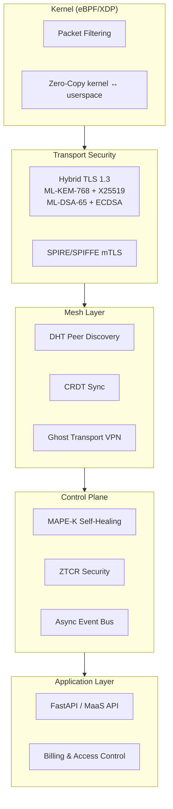

# x0tta6bl4 — Autonomous Self-Healing Mesh Networking Platform

[](LICENSE)
[](https://github.com/x0tta6bl4-ai/x0tta6bl4/security/code-scanning)


[](https://github.com/x0tta6bl4-ai/x0tmq)

**Autonomous Self-Healing · Post-Quantum Cryptography · eBPF/XDP Dataplane · Zero-Trust SPIRE**  
*Independent engineering research project by [x0tta6bl4](https://github.com/x0tta6bl4-ai).*

---

> **"The system detects failures in real time, automatically reroutes and heals without human intervention, and algorithmically verifies that all system invariants hold after recovery."**

---

> 📖 **Single Source of Truth:** See [`VERIFICATION_MATRIX.md`](docs/verification/VERIFICATION_MATRIX.md) for reproducible proof links across all subsystems.  
> 🔬 **Runbook Demo:** See [`AUTONOMOUS_RECOVERY_DEMO.md`](docs/architecture/AUTONOMOUS_RECOVERY_DEMO.md) for the 6-step Autonomous Recovery Demonstration.  
> **🇬🇧 English.** [🇷🇺 Русская версия](docs/ru/README.md)

---

## 🏛️ Verifiable Subsystem Status (3-Tier Taxonomy)

| Subsystem / Feature | Status | Proof / Evidence Link | Command / Artifact |
|:---|:---:|:---|:---|
| **Validation Framework** | `✅ VERIFIED` | [`tests/api/test_api_error_contract.py`](tests/api/test_api_error_contract.py) | `pytest tests/api/test_api_error_contract.py` |
| **PQC ML-KEM-768 & ML-DSA-65** | `✅ VERIFIED` | [`src/security/pqc/`](src/security/pqc/) | `python3 -c "import src.security.pqc as pqc; print(pqc.is_liboqs_available())"` |
| **XDP Decision Simulator** | `✅ VERIFIED` | [`ebpf/prod/bench_test.go`](ebpf/prod/bench_test.go) | `go test -bench=BenchmarkXDPDecisionSimulator ./ebpf/prod` |
| **MCP Operator Tools** | `✅ VERIFIED` | [`mcp-server/test_operator_tools.py`](mcp-server/test_operator_tools.py) | `pytest mcp-server/test_operator_tools.py` |
| **Autonomous Recovery Loop** | `🟡 VALIDATED IN LAB` | [`tests/test_mapek_ai_contracts_e2e.py`](tests/test_mapek_ai_contracts_e2e.py) | `pytest tests/test_mapek_ai_contracts_e2e.py` |
| **Autonomous Network Autopilot** | `🟡 VALIDATED IN LAB` | [`scripts/ops/run_self_healing_autopilot_cycle.py`](scripts/ops/run_self_healing_autopilot_cycle.py) | `python3 scripts/ops/run_self_healing_autopilot_cycle.py --cycles 1` |
| **1M+ PPS Physical Hardware** | `⚪ TARGET` | Physical hardware testbed | Planned benchmark on bare-metal NIC |

---

## ⚡ Quick Start

```bash
git clone https://github.com/x0tta6bl4-ai/x0tta6bl4.git
cd x0tta6bl4

# Run one-command clean environment quickstart
bash quickstart/demo.sh

# Or start local mesh (SPIRE + 2 nodes + MAPE-K)
docker compose -f deploy/docker-compose/compose.yaml up -d
curl -s http://localhost:9100/health
```

[Full docs →](docs/) | [Verification Matrix →](docs/verification/VERIFICATION_MATRIX.md) | [Telegram](https://t.me/x0tta6bl4_ai) | [Issues](https://github.com/x0tta6bl4-ai/x0tta6bl4/issues)

---

## Architecture



## Components

| Component | Lang | Lines | Status |
|-----------|------|-------|--------|
| PQC (ML-KEM-768/1024 + ML-DSA-65/87) | Python | ~3,500 | ✅ Tested via liboqs |
| MAPE-K self-healing loop | Python | ~1,900 | ✅ 4/4 tests |
| MaaS API (REST, FastAPI) | Python | ~5,000 | ✅ 35+ handlers |
| eBPF/XDP dataplane | C | ~1,500 | ✅ Kernel-level |
| Anti-censorship / DPI bypass | Python/Sh | ~2,000 | ✅ Reality + XHTTP |
| Ghost Transport VPN | Python | ~2,000 | ✅ Docker-ready |
| Billing & Access | Python | ~1,200 | ✅ Subscription model |
| **x0tMQ** (MAVLink PQC) | Python | ~775 | ✅ [IETF Draft](https://github.com/x0tta6bl4-ai/x0tmq) |

## Benchmarks

| Metric | Value | Conditions |
|--------|-------|------------|
| XDP TX throughput | 141,667 PPS | pktgen → XDP_TX |
| XDP RX throughput | 49,000 PPS | XDP_DROP raw |
| PQC hybrid handshake | <50 ms | ML-KEM-768 + ML-DSA-65, localhost |
| MAPE-K MTTD | <20 s | Time to detect anomaly |
| MAPE-K MTTR | ~3 min | Autonomous recovery |
| Dependencies | 376 (lock file) | Python |

## Security

- **CodeQL**: 0 open alerts (100% clean baseline)
- **Bandit**: 0 HIGH, 0 CRITICAL
- **Dependabot**: Auto-patches active
- **CVE fixes**: 18 (including recent yt-dlp, starlette, PyJWT patches)
- **ZTCR chaos tests**: 29 scenarios

## Languages

Python 71.8% · C 19.8% · Shell 4.1% · Go 1.2% · HTML 1% · TS/JS 0.8% · others 1.3%

**1,085 commits · 4,736 source files · 352 MB**

---

*Independent engineering project. Verified by machines, not marketing.*

---

## 🇷🇺 Русская версия

Полная русская версия: [`docs/ru/README.md`](docs/ru/README.md)