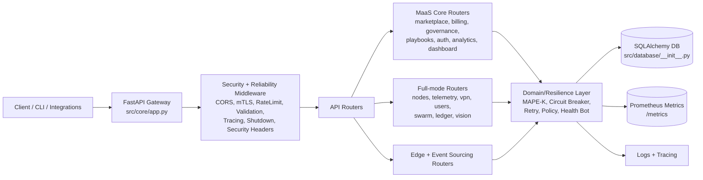
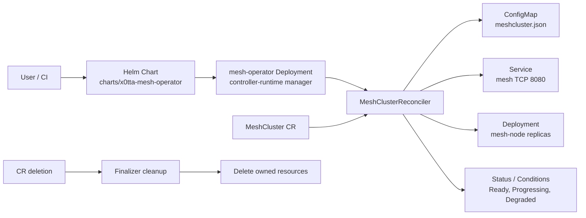
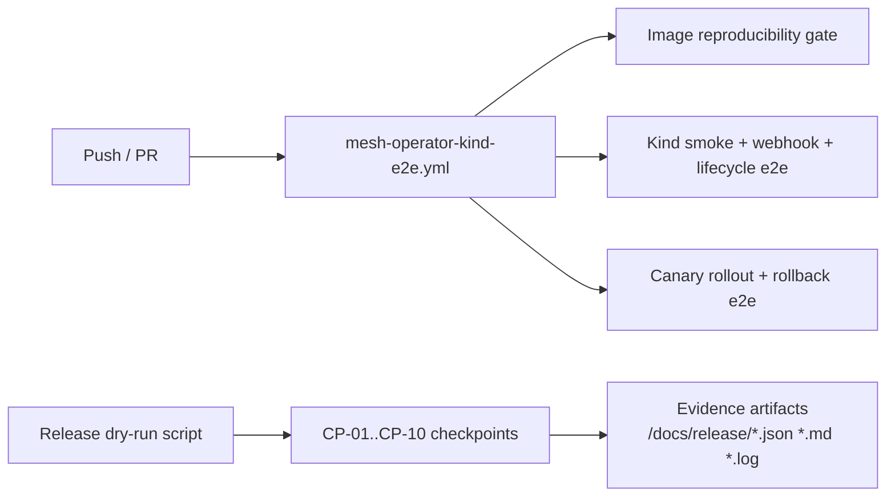

# x0tta6bl4 Architecture Diagrams (As-Built)

**Version:** `v3.4.0`  
**Updated:** `2026-03-05`  
**Status:** `aligned with repository code`

## Source of truth

This document is aligned to:

- `src/core/app.py` (FastAPI composition, middleware chain, router registration)
- `src/database/__init__.py` (SQLAlchemy models, DB circuit-breaker wiring)
- `src/monitoring/maas_metrics.py` and `src/monitoring/metrics.py` (business + platform metrics)
- `mesh-operator/cmd/manager/main.go` (operator manager bootstrapping)
- `mesh-operator/controllers/meshcluster_controller.go` (reconcile logic)
- `charts/x0tta-mesh-operator/templates/operator/deployment.yaml` (runtime args and probes)
- `scripts/ops/mesh_operator_release_dry_run.sh` (release control checkpoints)

## 1) Runtime Architecture (MaaS API + Services)

### Router loading contract

- Always loaded: `maas_legacy`, `maas_compat`, `maas_auth`, `maas_playbooks`, `maas_supply_chain`, `maas_marketplace`, `maas_governance`, `maas_analytics`, `maas_billing`, `billing`, `maas_agent_mesh`, `maas_dashboard`, `edge.api`, `event_sourcing.api`.
- Full mode only (`MAAS_LIGHT_MODE=false`): `maas_nodes`, `maas_policies`, `maas_telemetry`, `vpn`, `users`, `swarm`, `ledger_endpoints`, `swarm_endpoints`, `vision_endpoints`.

## 2) Kubernetes Control Plane (mesh-operator)

### Reconcile contract

- Reconcile loop: `ConfigMap` -> `Service` -> `Deployment` -> `status patch`.
- Finalizer enforces cleanup on delete.
- Status reflects `ObservedGeneration`, `ReadyReplicas`, and phase transitions.
- Default requeue behavior is active even in steady state (heartbeat reconciliation).

## 3) Release Control Architecture

Current dry-run control points include canary rollback validation (`CP-10`), so release evidence and CI gates use the same control model.

