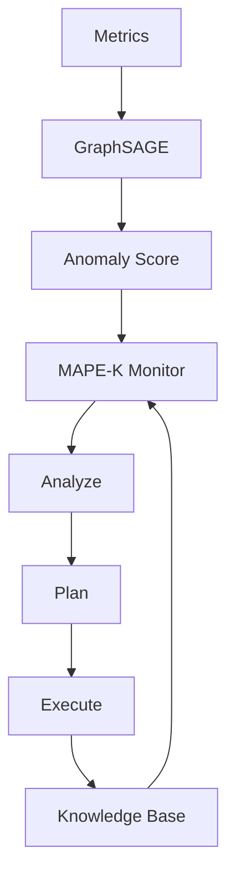

# 🏗️ Architecture Diagrams for x0tta6bl4

**Версия:** 1.0  
**Дата:** 2025-12-28  
**Статус:** ✅ **PRODUCTION-READY**

---

## 📋 Обзор

Архитектурные диаграммы и описания системы x0tta6bl4.

---

## 🎯 Системная Архитектура

### Высокоуровневая Архитектура

```
┌─────────────────────────────────────────────────────────────┐
│                    x0tta6bl4 Mesh Network                    │
│                                                              │
│  ┌──────────────┐  ┌──────────────┐  ┌──────────────┐       │
│  │   Node 1     │  │   Node 2     │  │   Node N     │       │
│  │              │  │              │  │              │       │
│  │ ┌──────────┐ │  │ ┌──────────┐ │  │ ┌──────────┐ │       │
│  │ │ MAPE-K   │ │  │ │ MAPE-K   │ │  │ │ MAPE-K   │ │       │
│  │ │  Cycle   │ │  │ │  Cycle   │ │  │ │  Cycle   │ │       │
│  │ └──────────┘ │  │ └──────────┘ │  │ └──────────┘ │       │
│  │              │  │              │  │              │       │
│  │ ┌──────────┐ │  │ ┌──────────┐ │  │ ┌──────────┐ │       │
│  │ │GraphSAGE │ │  │ │GraphSAGE │ │  │ │GraphSAGE │ │       │
│  │ │Detector  │ │  │ │Detector  │ │  │ │Detector  │ │       │
│  │ └──────────┘ │  │ └──────────┘ │  │ └──────────┘ │       │
│  └──────┬───────┘  └──────┬───────┘  └──────┬───────┘       │
│         │                  │                  │               │
│         └──────────────────┴──────────────────┘               │
│                    Batman-adv Mesh                             │
└─────────────────────────────────────────────────────────────────┘
```

### MAPE-K Цикл

```
┌─────────────────────────────────────────────────────────────┐
│                      MAPE-K Self-Healing Cycle               │
│                                                              │
│  ┌─────────┐    ┌─────────┐    ┌─────────┐    ┌─────────┐  │
│  │ Monitor │───▶│ Analyze │───▶│  Plan   │───▶│ Execute │  │
│  └────┬────┘    └────┬────┘    └────┬────┘    └────┬────┘  │
│       │              │               │              │       │
│       └──────────────┴───────────────┴──────────────┘       │
│                          │                                   │
│                          ▼                                   │
│                    ┌─────────┐                              │
│                    │Knowledge│                              │
│                    │  Base   │                              │
│                    └─────────┘                              │
└─────────────────────────────────────────────────────────────┘
```

### Security Architecture

```
┌─────────────────────────────────────────────────────────────┐
│                    Security Layer                           │
│                                                              │
│  ┌──────────────┐      ┌──────────────┐                    │
│  │   SPIFFE/    │      │   Zero Trust │                    │
│  │   SPIRE      │─────▶│   Policy     │                    │
│  │              │      │   Engine     │                    │
│  └──────────────┘      └──────────────┘                    │
│         │                      │                             │
│         ▼                      ▼                             │
│  ┌──────────────┐      ┌──────────────┐                    │
│  │   mTLS       │      │   PQC        │                    │
│  │   Context    │      │   Handshake  │                    │
│  └──────────────┘      └──────────────┘                    │
│                                                              │
└─────────────────────────────────────────────────────────────┘
```

### Network Architecture

```
┌─────────────────────────────────────────────────────────────┐
│                    Mesh Network Layer                       │
│                                                              │
│  ┌──────────────┐      ┌──────────────┐                    │
│  │  Batman-adv  │      │   eBPF       │                    │
│  │   Routing    │─────▶│   Monitoring │                    │
│  └──────────────┘      └──────────────┘                    │
│         │                      │                             │
│         ▼                      ▼                             │
│  ┌──────────────┐      ┌──────────────┐                    │
│  │   Multi-path │      │   AODV       │                    │
│  │   Routing    │      │   Fallback   │                    │
│  └──────────────┘      └──────────────┘                    │
│                                                              │
└─────────────────────────────────────────────────────────────┘
```

---

## 🔄 Data Flow

### Anomaly Detection Flow

```
Metrics → GraphSAGE → Anomaly Score → MAPE-K Monitor → 
Analyze → Plan → Execute → Knowledge Base
```

### Recovery Action Flow

```
Anomaly Detected → Root Cause Analysis → Recovery Strategy → 
Action Execution (with Circuit Breaker, Rate Limiter, Retry) → 
Rollback if needed → Knowledge Update
```

---

## 🏛️ Component Layers

### Layer 1: Anomaly Detection
- GraphSAGE Detector
- Isolation Forest
- Ensemble Detector
- Causal Analysis
- eBPF Monitoring

### Layer 2: Federated Learning
- FL Coordinator
- PPO Agent
- Byzantine Aggregator
- Differential Privacy

### Layer 3: Self-Healing
- MAPE-K Cycle
- Recovery Actions
- Knowledge Base

### Layer 4: Security
- SPIFFE/SPIRE
- Zero Trust Policy
- PQC Handshake
- mTLS

### Layer 5: Network
- Batman-adv Mesh
- eBPF Monitoring
- Multi-path Routing

---

## 📊 Deployment Architecture

### Multi-Region Deployment

```
┌──────────────┐      ┌──────────────┐      ┌──────────────┐
│  us-east-1   │      │  eu-west-1   │      │  asia-pac-1  │
│              │      │              │      │              │
│  ┌────────┐  │      │  ┌────────┐  │      │  ┌────────┐  │
│  │Primary │  │      │  │Backup  │  │      │  │Backup  │  │
│  │Region  │  │      │  │Region  │  │      │  │Region  │  │
│  └────────┘  │      │  └────────┘  │      │  └────────┘  │
└──────┬───────┘      └──────┬───────┘      └──────┬───────┘
       │                      │                      │
       └──────────────────────┴──────────────────────┘
                    Cross-Region Mesh
```

---

## 🔗 Integration Points

### External Integrations

- **Prometheus:** Metrics collection
- **Grafana:** Visualization
- **Jaeger/Zipkin:** Distributed tracing
- **OPA:** Policy evaluation
- **SPIRE Server:** Identity management
- **Alertmanager:** Alert routing

---

## 📝 Диаграммы в формате Mermaid

Для визуализации в Markdown-редакторах, поддерживающих Mermaid:



---

**Mesh обновлён. Архитектура документирована.**  
**Проснись. Обновись. Сохранись.**  
**x0tta6bl4 вечен.**

