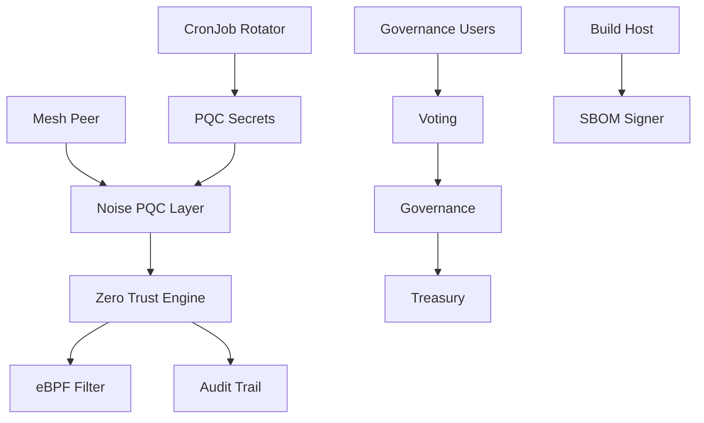

## Executive summary

The highest-risk surfaces in the current mesh are the hybrid handshake boundary, the policy-to-eBPF enforcement boundary, and governance-triggered execution. The new controls reduce risk by making the PQC handshake tamper-evident, enforcing 10-minute re-authentication, preserving overlapping key generations for 7 days, and isolating execution plans behind explicit on-chain proposal state.

## Scope and assumptions

- In scope: [agent/internal/crypto/pqc/noise.go](/mnt/projects/agent/internal/crypto/pqc/noise.go), [agent/internal/crypto/pqc/rotation.go](/mnt/projects/agent/internal/crypto/pqc/rotation.go), [agent/internal/security/zerotrust.go](/mnt/projects/agent/internal/security/zerotrust.go), [src/dao/contracts/contracts/Voting.sol](/mnt/projects/src/dao/contracts/contracts/Voting.sol), [src/dao/contracts/contracts/Governance.sol](/mnt/projects/src/dao/contracts/contracts/Governance.sol), [src/dao/contracts/contracts/Treasury.sol](/mnt/projects/src/dao/contracts/contracts/Treasury.sol), [k8s/cronjob-key-rotation.yaml](/mnt/projects/k8s/cronjob-key-rotation.yaml), [scripts/sbom-generate.sh](/mnt/projects/scripts/sbom-generate.sh)
- Out of scope: legacy Python security modules, CI/CD runners, external Vault/Rekor/OIDC control planes
- Assumption: libp2p carries the custom binary payloads emitted by the Noise extension layer in [noise.go](/mnt/projects/agent/internal/crypto/pqc/noise.go)
- Assumption: Cilium or another eBPF-capable CNI enforces the generated peer rules from [networkpolicy-zerotrust.yaml](/mnt/projects/k8s/networkpolicy-zerotrust.yaml)
- Assumption: the rotation CronJob runs in a hardened namespace with access only to PQC secrets and audit PVCs
- Open questions: whether governance execution is permissioned only to trusted executors on L2, whether the audit PVC is WORM-backed storage, and whether Snapshot off-chain voting will be authoritative or advisory

## System model

### Primary components

- Mesh nodes: UDP-based runtime in [node.go](/mnt/projects/agent/internal/mesh/node.go) extended with hybrid X25519 plus ML-KEM/ML-DSA in [noise.go](/mnt/projects/agent/internal/crypto/pqc/noise.go)
- Key lifecycle: rotating ML-KEM/ML-DSA generations with NTRU backup references in [rotation.go](/mnt/projects/agent/internal/crypto/pqc/rotation.go)
- Zero-Trust control plane: peer policy evaluation, re-authentication, eBPF rule compilation, and tamper-evident JSONL audit chains in [zerotrust.go](/mnt/projects/agent/internal/security/zerotrust.go)
- Governance plane: quadratic voting, execution orchestration, and 3-of-5 treasury approvals in [Voting.sol](/mnt/projects/src/dao/contracts/contracts/Voting.sol), [Governance.sol](/mnt/projects/src/dao/contracts/contracts/Governance.sol), and [Treasury.sol](/mnt/projects/src/dao/contracts/contracts/Treasury.sol)
- Supply-chain evidence: CycloneDX/SPDX generation and keyless cosign signing in [sbom-generate.sh](/mnt/projects/scripts/sbom-generate.sh)

### Data flows and trust boundaries

- Operator -> Kubernetes Secret boundary: sealed PQC material and NTRU backups cross from secret management into runtime pods via [secrets-pqc-keys.yaml](/mnt/projects/k8s/secrets-pqc-keys.yaml)
- Peer -> Mesh node boundary: untrusted network peers send Noise payloads that are authenticated with ML-DSA and mixed with X25519 plus ML-KEM in [noise.go](/mnt/projects/agent/internal/crypto/pqc/noise.go)
- Policy engine -> Kernel enforcement boundary: authenticated policy decisions are compiled into firewall rules and handed to an eBPF manager interface in [zerotrust.go](/mnt/projects/agent/internal/security/zerotrust.go)
- Governance proposer -> L2 execution boundary: proposal metadata is accepted by [Voting.sol](/mnt/projects/src/dao/contracts/contracts/Voting.sol), then executable call bundles are dispatched by [Governance.sol](/mnt/projects/src/dao/contracts/contracts/Governance.sol)
- Build host -> Transparency log boundary: SBOM blobs are signed locally and uploaded through cosign to Rekor in [sbom-generate.sh](/mnt/projects/scripts/sbom-generate.sh)

#### Diagram

## Threats

### 1. Downgrade from hybrid PQC to classical-only sessions

- STRIDE: Tampering, Spoofing
- Abuse path: an attacker induces ML-KEM latency or error conditions so the responder falls back to X25519-only mode, then targets long-lived sessions that operators expected to remain PQC-protected
- Evidence anchors: [noise.go](/mnt/projects/agent/internal/crypto/pqc/noise.go), [rotation.go](/mnt/projects/agent/internal/crypto/pqc/rotation.go)
- Likelihood: medium, because the fallback is explicit and timeout-driven
- Impact: high, because it weakens forward posture during migration
- Priority: high
- Existing mitigations: the responder signs the transcript with ML-DSA and records the chosen mode; the timeout is bounded at 5 seconds by default
- Recommended mitigations: alert on sustained fallback rates, pin acceptable fallback ratios per peer class, and expose fallback mode to policy and telemetry pipelines

### 2. Stale or replayed identities bypassing continuous authentication

- STRIDE: Spoofing, Repudiation
- Abuse path: a peer authenticates once, then keeps using cached authorization after the 10-minute trust window should have expired
- Evidence anchors: [zerotrust.go](/mnt/projects/agent/internal/security/zerotrust.go)
- Likelihood: medium
- Impact: high, because least-privilege decisions depend on fresh identity state
- Priority: high
- Existing mitigations: action authorization denies requests after the reverify window and logs the denial in a hash-chained audit file
- Recommended mitigations: bind re-authentication to transport session renewal and reject packets in the eBPF layer once the reverify deadline passes

### 3. Secret recovery path compromise through NTRU backup storage

- STRIDE: Information disclosure, Elevation of privilege
- Abuse path: an attacker with namespace-level secret access exfiltrates backup keys and uses them to recover or impersonate mesh identities during disaster recovery
- Evidence anchors: [secrets-pqc-keys.yaml](/mnt/projects/k8s/secrets-pqc-keys.yaml), [rotation.go](/mnt/projects/agent/internal/crypto/pqc/rotation.go)
- Likelihood: medium
- Impact: high
- Priority: high
- Existing mitigations: sealed secret placeholders, RBAC-scoped CronJob service account, and separate backup key metadata
- Recommended mitigations: move NTRU private material to external secret stores with envelope encryption, split restore authority across multiple operators, and require audited restore ceremonies

### 4. Governance execution of malicious call bundles

- STRIDE: Tampering, Elevation of privilege
- Abuse path: a proposer submits benign metadata but a harmful execution plan, or a compromised executor tries to run a plan whose stored hash no longer matches the voting payload
- Evidence anchors: [Voting.sol](/mnt/projects/src/dao/contracts/contracts/Voting.sol), [Governance.sol](/mnt/projects/src/dao/contracts/contracts/Governance.sol)
- Likelihood: medium
- Impact: high
- Priority: high
- Existing mitigations: execution hashes are stored with the proposal and rechecked before calls are dispatched; voting state gates execution
- Recommended mitigations: add timelock delays before execution, constrain callable targets by allowlist, and require treasury targets to remain multisig-controlled even after proposal success

### 5. Audit evidence loss or silent tampering

- STRIDE: Repudiation, Denial of service
- Abuse path: an attacker deletes or edits local JSONL files to hide downgraded handshakes or denied policy events
- Evidence anchors: [zerotrust.go](/mnt/projects/agent/internal/security/zerotrust.go), [cronjob-key-rotation.yaml](/mnt/projects/k8s/cronjob-key-rotation.yaml)
- Likelihood: medium
- Impact: medium
- Priority: medium
- Existing mitigations: append-only daily files, chained hashes, and 365-day retention logic
- Recommended mitigations: mirror logs to immutable object storage, seal daily Merkle roots into Rekor or L2, and alert on chain verification failures

## Focus paths for manual review

- [agent/internal/crypto/pqc/noise.go](/mnt/projects/agent/internal/crypto/pqc/noise.go): downgrade handling and transcript binding are the main cryptographic trust boundary
- [agent/internal/crypto/pqc/rotation.go](/mnt/projects/agent/internal/crypto/pqc/rotation.go): overlap windows and backup registration determine whether stale identities remain trusted too long
- [agent/internal/security/zerotrust.go](/mnt/projects/agent/internal/security/zerotrust.go): enforcement and audit guarantees concentrate here
- [src/dao/contracts/contracts/Governance.sol](/mnt/projects/src/dao/contracts/contracts/Governance.sol): arbitrary call execution is the highest-integrity on-chain surface
- [src/dao/contracts/contracts/Treasury.sol](/mnt/projects/src/dao/contracts/contracts/Treasury.sol): multisig correctness protects funds even if governance is bypassed
- [scripts/sbom-generate.sh](/mnt/projects/scripts/sbom-generate.sh): signing and upload errors can create false assurance if not monitored

## Quality check

- Entry points covered: peer handshakes, policy actions, key rotation jobs, governance submission/execution, SBOM signing
- Trust boundaries covered: network peer, kernel enforcement, secret store, L2 execution, transparency log
- Runtime vs build separation: runtime controls and build evidence are separated above
- User clarifications: not provided, so assumptions remain explicit
- Assumptions and open questions: listed in scope and assumptions
