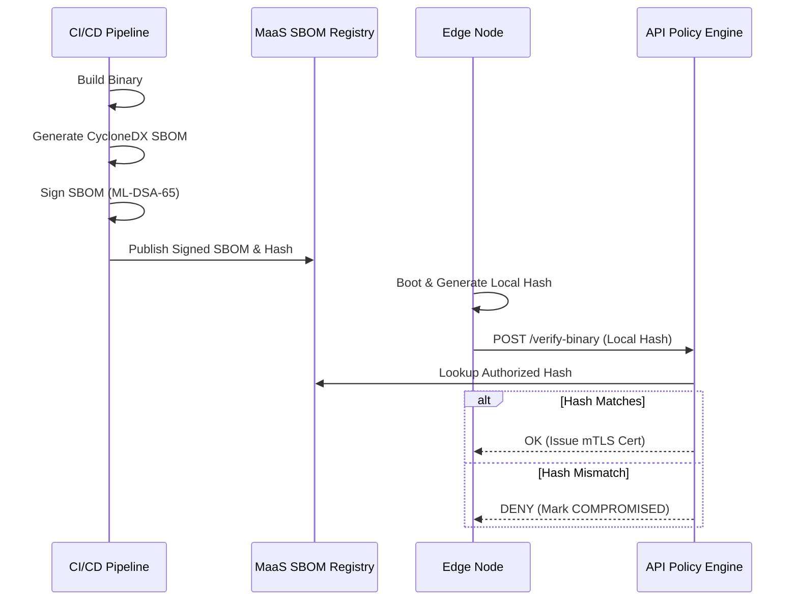
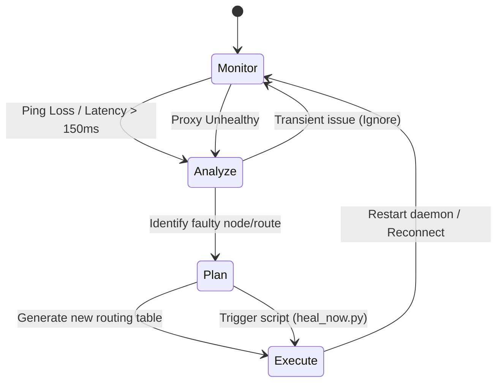
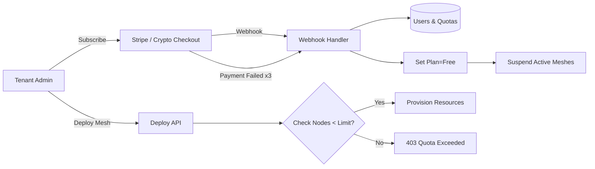

# x0tta6bl4 Architecture Diagrams

The project uses Mermaid.js for architecture visualizations. You can render these blocks on GitHub or any compatible markdown viewer.

## 1. High-Level MaaS Architecture

```mermaid
graph TD
    subgraph Control Plane [x0tta6bl4 Control Plane (SaaS)]
        API[FastAPI Gateway]
        DB[(PostgreSQL)]
        Redis[(Redis Telemetry)]
        VAULT[HashiCorp Vault]
        SPIRE[SPIRE Server]
        
        API --> DB
        API --> Redis
        API --> VAULT
    end

    subgraph Tenant A [Customer Mesh A]
        NodeA1[Edge Node 1]
        NodeA2[Relay Node 2]
        NodeA3[Exit Node 3]
        
        NodeA1 <-->|PQC WireGuard/SOCKS5| NodeA2
        NodeA2 <-->|PQC WireGuard/SOCKS5| NodeA3
    end

    subgraph Tenant B [Customer Mesh B]
        NodeB1[Edge Node 1]
    end

    SPIRE -->|Issues SVIDs| NodeA1
    SPIRE -->|Issues SVIDs| NodeA2
    SPIRE -->|Issues SVIDs| NodeA3
    SPIRE -->|Issues SVIDs| NodeB1

    NodeA1 -.->|Heartbeats & Telemetry| API
    NodeA2 -.->|Heartbeats & Telemetry| API
    NodeB1 -.->|Heartbeats & Telemetry| API
```

## 2. Supply Chain & Attestation Flow



## 3. MAPE-K Self-Healing Loop



## 4. B2B Billing & Quota Lifecycle

