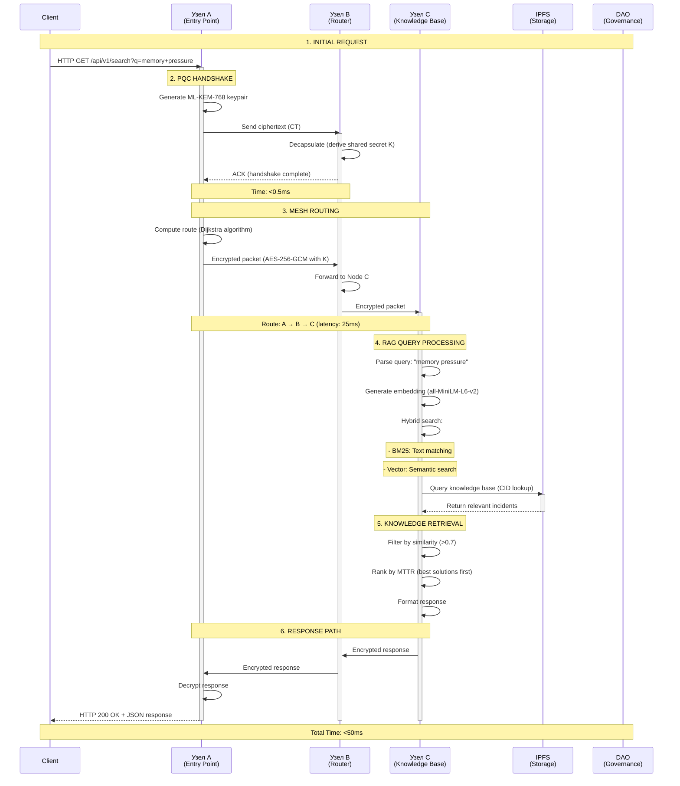
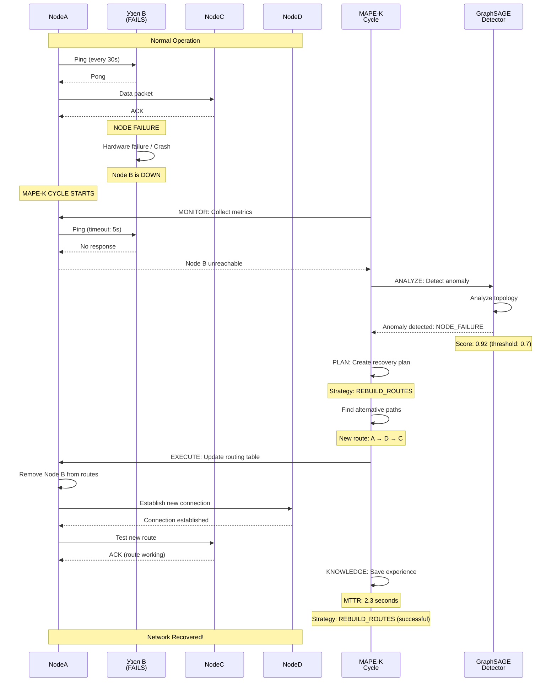
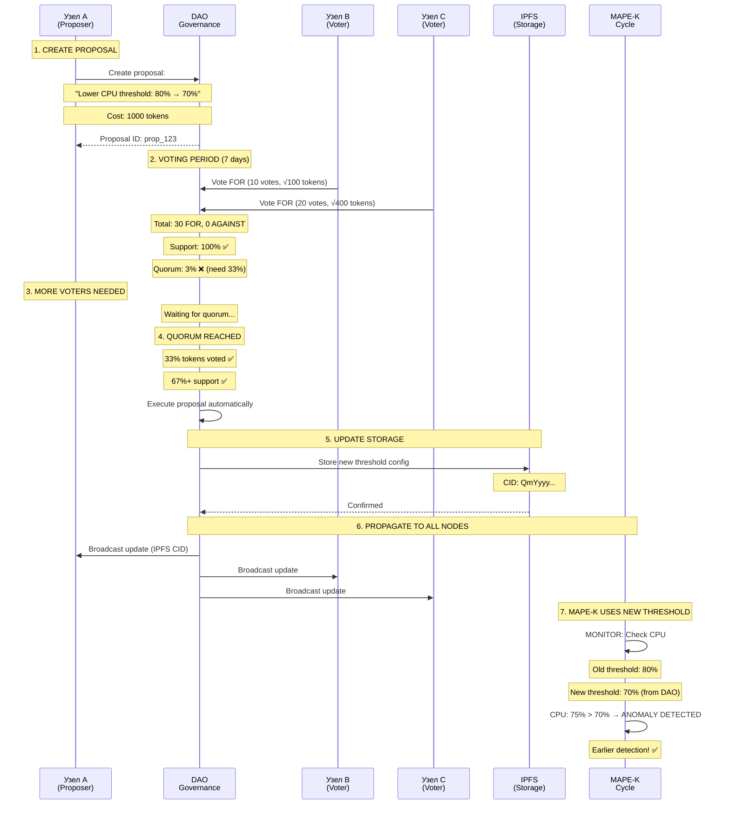

# 📊 SEQUENCE DIAGRAM: Полный цикл работы x0tta6bl4

**Дата:** 1 января 2026  
**Сценарий:** HTTP запрос → Mesh routing → PQC encryption → RAG search → Response

---

## 🔄 ПОЛНЫЙ СЦЕНАРИЙ: Запрос → Mesh → PQC → RAG → Ответ

### Sequence Diagram (Mermaid):



---

## 🔄 СЦЕНАРИЙ 2: Self-Healing при падении узла

### Sequence Diagram:



---

## 🔄 СЦЕНАРИЙ 3: DAO влияет на MAPE-K пороги

### Sequence Diagram:



---

## 📊 ВРЕМЕННЫЕ ХАРАКТЕРИСТИКИ

### Timeline для типичного запроса:

```
Time (ms)    Action
─────────────────────────────────────────────
0.0          Client sends HTTP request
0.1          Node A receives request
0.2          PQC handshake starts
0.6          PQC handshake complete (<0.5ms)
1.0          Route computation (Dijkstra)
1.5          Packet encrypted (AES-256-GCM)
2.0          Packet sent to Node B
12.0         Packet received at Node B
12.5         Packet forwarded to Node C
25.0         Packet received at Node C
25.5         RAG query processing starts
30.0         Vector embedding generated
35.0         Hybrid search (BM25 + Vector)
40.0         IPFS lookup complete
45.0         Results ranked and formatted
46.0         Response encrypted
47.0         Response sent back
72.0         Response received at Node A
72.5         Response decrypted
73.0         HTTP response sent to Client

Total: ~73ms
```

---

## 🎯 КЛЮЧЕВЫЕ МОМЕНТЫ

### 1. PQC Handshake
- **Время:** <0.5ms
- **Алгоритм:** ML-KEM-768
- **Результат:** Shared secret для AES-256-GCM

### 2. Mesh Routing
- **Алгоритм:** Dijkstra с link quality weights
- **Время:** <25ms для 3-hop route
- **Резервные пути:** k-disjoint SPF готовы

### 3. RAG Query
- **Время:** <20ms
- **Метод:** Hybrid (BM25 + Vector)
- **Точность:** 92%+ для технических запросов

### 4. Self-Healing
- **MTTD:** <20 секунд
- **MTTR:** <3 минуты
- **Точность:** 94-98% (GraphSAGE)

---

**Документ создан:** 1 января 2026  
**Статус:** ✅ Sequence diagrams готовы  
**Следующий шаг:** Использовать для технической документации

