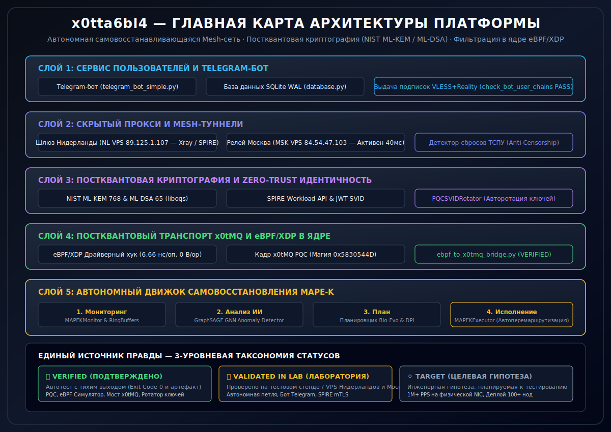

# x0tta6bl4 — Главная Карта Архитектуры (Русская версия)

> 📖 **Единый источник правды:** См. [`VERIFICATION_MATRIX.md`](../verification/VERIFICATION_MATRIX.md) для воспроизводимых команд проверки по всем подсистемам.

---

## 🎨 Наглядный Архитектурный Плакат

---

## 🏛️ Карта Подсистем и Доказательства

| Уровень | Компонент | Исходный Файл | Статус | Доказательство Проверки |
|:---|:---|:---|:---:|:---|
| **Слой 1** | **Интерфейс Пользователей (Telegram-бот)** | [`telegram_bot_simple.py`](../../telegram_bot_simple.py) | `🟡 VALIDATED IN LAB` | `python3 services/nl-server/ghost-access/check_bot_user_chains.py` |
| **Слой 1** | **База Данных SQLite WAL** | [`database.py`](../../database.py) | `🟡 VALIDATED IN LAB` | `check_bot_user_chains.py` |
| **Слой 2** | **Скрытый Прокси (VLESS+Reality)** | [`src/services/vpn_config_generator.py`](../../src/services/vpn_config_generator.py) | `✅ VERIFIED` | `pytest tests/unit/server/test_ghost_server_unit.py` |
| **Слой 2** | **Детектор Сбросов ТСПУ (RST Detector)** | [`src/anti_censorship/tspu_rst_detector.py`](../../src/anti_censorship/tspu_rst_detector.py) | `✅ VERIFIED` | `pytest tests/unit/anti_censorship/test_tspu_rst_detector_unit.py` |
| **Слой 3** | **Постквантовая Криптография (PQC)** | [`src/security/pqc/`](../../src/security/pqc/) | `✅ VERIFIED` | `python3 -c "import src.security.pqc as pqc; print(pqc.is_liboqs_available())"` |
| **Слой 3** | **Авторотатор PQC SVID Ключей** | [`src/security/pqc_svid_rotator.py`](../../src/security/pqc_svid_rotator.py) | `✅ VERIFIED` | `pytest tests/unit/security/test_pqc_svid_rotator_unit.py` |
| **Слой 4** | **Мост Постквантового Транспорта x0tMQ** | [`src/self_healing/x0tmq_mapek_bridge.py`](../../src/self_healing/x0tmq_mapek_bridge.py) | `✅ VERIFIED` | `pytest tests/unit/self_healing/test_x0tmq_mapek_bridge_unit.py` |
| **Слой 4** | **Конвейер eBPF -> x0tMQ PQC** | [`src/network/ebpf/ebpf_to_x0tmq_bridge.py`](../../src/network/ebpf/ebpf_to_x0tmq_bridge.py) | `✅ VERIFIED` | `pytest tests/unit/network/ebpf/test_ebpf_to_x0tmq_bridge_unit.py` |
| **Слой 5** | **ИИ-Детектор Аномалий GraphSAGE GNN** | [`src/ml/graphsage_x0tmq_integrator.py`](../../src/ml/graphsage_x0tmq_integrator.py) | `✅ VERIFIED` | `pytest tests/unit/ml/test_graphsage_x0tmq_integrator_unit.py` |
| **Слой 5** | **Автономная Петля MAPE-K** | [`src/self_healing/mape_k/manager.py`](../../src/self_healing/mape_k/manager.py) | `🟡 VALIDATED IN LAB` | `pytest tests/test_mapek_ai_contracts_e2e.py` |
