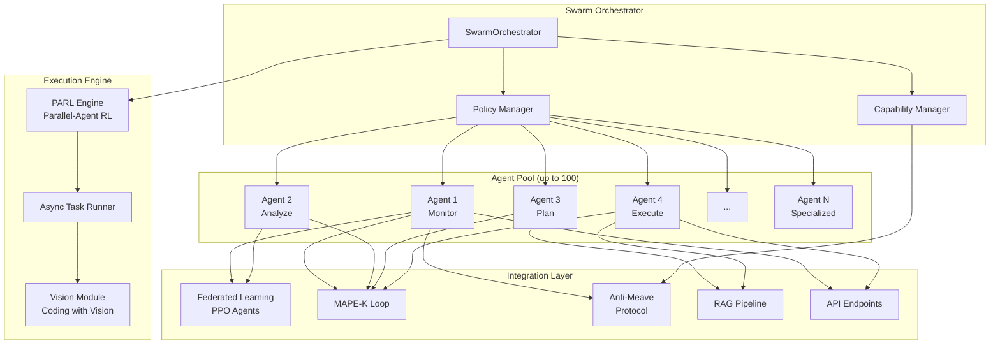

# Архитектура Agent Swarm для x0tta6bl4

## Обзор

На основе анализа проекта x0tta6bl4 и возможностей Kimi K2.5 (1T параметров, рой агентов, PARL), предлагается архитектура интеграции роя агентов в существующую mesh-сеть.

## Текущая архитектура проекта

### Ключевые компоненты:
1. **Mesh Network Layer**: `src/network/mesh_router.py`, `src/network/mesh_node.py`
2. **MAPE-K Self-Healing**: `src/self_healing/mape_k.py`, `src/core/mape_k_mttr_optimizer.py`
3. **Federated Learning**: `src/federated_learning/ppo_agent.py` (PPO агенты для роутинга)
4. **Security**: `src/westworld/anti_meave_protocol.py` (Capability-based агенты)
5. **RAG Pipeline**: `src/rag/batch_retrieval.py` (параллельная обработка)
6. **API Layer**: `src/api/vpn.py`, `src/api/v3_endpoints.py`

## Точки интеграции Swarm-агентов

### 1. Интеграция с Federated Learning
```
Существующий: PPOAgent (src/federated_learning/ppo_agent.py)
Расширение: SwarmPPOAgent с PARL
```

**Возможности:**
- До 100 параллельных PPO-агентов на нодах
- PARL для координации обучения
- 4.5x ускорение vs последовательное выполнение

### 2. Интеграция с MAPE-K
```
Существующий: ParallelMAPEKExecutor (src/core/mape_k_mttr_optimizer.py)
Расширение: SwarmMAPEKCoordinator
```

**Возможности:**
- Параллельное выполнение Monitor/Analyze/Plan/Execute
- До 1500 параллельных шагов (вызовов инструментов)
- Динамическое создание под-агентов для подзадач

### 3. Интеграция с Anti-Meave Protocol
```
Существующий: MeshNodeController, AntiMeaveOracle
Расширение: SwarmCapabilityOrchestrator
```

**Возможности:**
- Capability-based агенты с swarm-координацией
- Защита от takeover при масштабировании
- Автоматическое обнаружение аномалий в рое

### 4. Интеграция с RAG Pipeline
```
Существующий: BatchRetriever (src/rag/batch_retrieval.py)
Расширение: SwarmRAGCoordinator
```

**Возможности:**
- Параллельная обработка запросов через рой агентов
- Адаптивное масштабирование (1-100 агентов)
- Vision-based анализ результатов

## Архитектура Agent Swarm



## Компоненты архитектуры

### 1. SwarmOrchestrator
**Назначение:** Центральный координатор роя агентов

**Ключевые методы:**
- `create_swarm(task: Task) -> Swarm` - создание роя для задачи
- `coordinate_agents(swarm_id: str) -> None` - координация агентов
- `terminate_swarm(swarm_id: str) -> None` - завершение роя

**Интеграция:**
- Использует PARL для обучения стратегиям координации
- Интегрируется с AntiMeaveOracle для безопасности

### 2. Agent (Base Class)
**Назначение:** Базовый класс для всех агентов в рое

**Атрибуты:**
- `agent_id: str` - уникальный идентификатор
- `capabilities: List[Capability]` - список capability
- `policy: AgentPolicy` - политика из Anti-Meave
- `state: AgentState` - текущее состояние

**Методы:**
- `execute_task(task: Task) -> Result` - выполнение задачи
- `communicate(target: Agent, message: Message) -> None` - коммуникация
- `report_status() -> Status` - отчет о статусе

### 3. PARLEngine
**Назначение:** Движок Parallel-Agent Reinforcement Learning

**Возможности:**
- До 1500 параллельных шагов
- Обучение с подкреплением для координации
- 4.5x ускорение vs последовательное выполнение

**Интеграция:**
- Расширяет `src/federated_learning/ppo_agent.py`
- Использует `ParallelMAPEKExecutor` для выполнения

### 4. VisionModule
**Назначение:** Визуальная отладка и анализ (Coding with Vision)

**Возможности:**
- Анализ изображений/скриншотов
- Визуализация mesh-топологии
- Автоматическая отладка через визуальный анализ

**Интеграция:**
- Работает с `src/network/mesh_router.py`
- Визуализирует результаты RAG

## API для управления роем

### Endpoints (расширение src/api/v3_endpoints.py)

```python
@router.post("/swarm/create")
async def create_swarm(request: SwarmCreateRequest) -> SwarmResponse

@router.get("/swarm/{swarm_id}/status")
async def get_swarm_status(swarm_id: str) -> SwarmStatus

@router.post("/swarm/{swarm_id}/task")
async def submit_task(swarm_id: str, task: TaskRequest) -> TaskResponse

@router.get("/swarm/{swarm_id}/agents")
async def list_agents(swarm_id: str) -> List[AgentInfo]

@router.post("/swarm/{swarm_id}/vision/analyze")
async def analyze_visual(swarm_id: str, image: UploadFile) -> VisionAnalysis
```

## Roadmap интеграции

### Phase 1: Foundation (1-2 недели)
- [ ] Создать базовый `SwarmOrchestrator`
- [ ] Реализовать `Agent` base class
- [ ] Интегрировать с существующим `AntiMeaveOracle`

### Phase 2: PARL Integration (2-3 недели)
- [ ] Расширить `PPOAgent` для swarm-координации
- [ ] Реализовать `PARLEngine`
- [ ] Интегрировать с `ParallelMAPEKExecutor`

### Phase 3: Vision Module (2 недели)
- [ ] Реализовать `VisionModule`
- [ ] Интегрировать с mesh-визуализацией
- [ ] Добавить визуальную отладку

### Phase 4: API & Testing (1-2 недели)
- [ ] Расширить API endpoints
- [ ] Написать тесты для swarm
- [ ] Документация

## Преимущества интеграции

1. **Производительность**: 4.5x ускорение через PARL
2. **Масштабируемость**: До 100 агентов, 1500 параллельных шагов
3. **Безопасность**: Интеграция с Anti-Meave Protocol
4. **Визуализация**: Coding with Vision для отладки
5. **Адаптивность**: Динамическое создание агентов без предварительного описания ролей

## Технические детали

### Требования
- Python 3.11+
- asyncio для параллелизма
- Интеграция с существующей БД
- Совместимость с mesh-сетью

### Зависимости
```
# Существующие
fastapi
pydantic
asyncio

# Новые (опционально)
torch  # для PARL
pillow  # для Vision
opencv-python  # для визуального анализа
```

## Заключение

Интеграция Agent Swarm на базе Kimi K2.5 в проект x0tta6bl4 позволит:
- Значительно ускорить обработку задач (4.5x)
- Масштабировать систему до 100 параллельных агентов
- Добавить визуальную отладку и анализ
- Сохранить существующую безопасность через Anti-Meave Protocol
