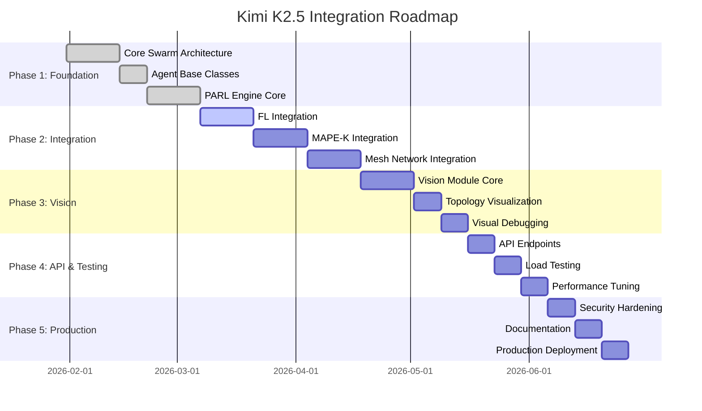

# Roadmap интеграции Kimi K2.5 в x0tta6bl4

## Обзор

Полный план интеграции возможностей Kimi K2.5 (1T параметров, рой агентов, PARL, Coding with Vision) в проект x0tta6bl4.

## Фазы интеграции

## Phase 1: Foundation (Недели 1-4)

### Week 1: Core Swarm Architecture

**Задачи:**
- [ ] Создать `src/swarm/__init__.py`
- [ ] Реализовать `SwarmOrchestrator`
- [ ] Реализовать `SwarmConfig`
- [ ] Настроить логирование и метрики

**Deliverables:**
- `src/swarm/orchestrator.py`
- `src/swarm/config.py`
- `src/swarm/metrics.py`

**Критерии приемки:**
- SwarmOrchestrator создает и управляет роем
- Метрики собираются корректно
- Unit tests проходят

### Week 2: Agent Base Classes

**Задачи:**
- [ ] Создать `Agent` base class
- [ ] Реализовать `AgentCapabilities`
- [ ] Интегрировать с `AntiMeaveOracle`
- [ ] Реализовать коммуникацию между агентами

**Deliverables:**
- `src/swarm/agent.py`
- `src/swarm/capabilities.py`
- `src/swarm/communication.py`

**Критерии приемки:**
- Агенты могут выполнять задачи
- Capability-based access control работает
- Коммуникация между агентами функционирует

### Week 3-4: PARL Engine Core

**Задачи:**
- [ ] Реализовать `PARLController`
- [ ] Реализовать `AgentWorker`
- [ ] Реализовать `TaskScheduler`
- [ ] Реализовать `ExperienceBuffer`
- [ ] Интегрировать PPO

**Deliverables:**
- `src/swarm/parl/controller.py`
- `src/swarm/parl/worker.py`
- `src/swarm/parl/scheduler.py`
- `src/swarm/parl/experience.py`

**Критерии приемки:**
- PARL выполняет до 1500 параллельных шагов
- Ускорение vs последовательное выполнение >= 3x
- Политика обновляется корректно

## Phase 2: Integration (Недели 5-8)

### Week 5-6: Federated Learning Integration

**Задачи:**
- [ ] Создать `PARLFederatedOrchestrator`
- [ ] Модифицировать `FederatedCoordinator`
- [ ] Реализовать параллельное обучение
- [ ] Тестирование на синтетических данных

**Deliverables:**
- `src/federated_learning/parl_integration.py`
- Обновленный `src/federated_learning/coordinator.py`

**Критерии приемки:**
- FL round выполняется в 4x быстрее
- Модель сходится корректно
- Byzantine-robustness сохраняется

### Week 7: MAPE-K Integration

**Задачи:**
- [ ] Создать `PARLMAPEKExecutor`
- [ ] Модифицировать `ParallelMAPEKExecutor`
- [ ] Параллелизовать фазы MAPE-K
- [ ] Интегрировать с `MTTROptimizer`

**Deliverables:**
- `src/core/parl_mapek_integration.py`
- Обновленный `src/core/mape_k_mttr_optimizer.py`

**Критерии приемки:**
- MAPE-K cycle выполняется в 4.5x быстрее
- Все фазы работают корректно
- Recovery time сокращается

### Week 8: Mesh Network Integration

**Задачи:**
- [ ] Создать `PARLMeshOptimizer`
- [ ] Интегрировать с `MeshRouter`
- [ ] Параллелизовать route optimization
- [ ] Параллелизовать anomaly detection

**Deliverables:**
- `src/network/parl_mesh_integration.py`
- Обновленный `src/network/mesh_router.py`

**Критерии приемки:**
- Route optimization выполняется в 4x быстрее
- Anomaly detection масштабируется до 100 нод
- Mesh topology обновляется корректно

## Phase 3: Vision (Недели 9-11)

### Week 9: Vision Module Core

**Задачи:**
- [ ] Создать `VisionProcessor`
- [ ] Реализовать object detection
- [ ] Реализовать anomaly detection
- [ ] Реализовать text extraction (OCR)

**Deliverables:**
- `src/vision/processor.py`
- `src/vision/detection.py`
- `src/vision/ocr.py`

**Критерии приемки:**
- VisionProcessor анализирует изображения < 2 сек
- Object detection точность > 90%
- OCR точность > 95%

### Week 10: Topology Visualization

**Задачи:**
- [ ] Создать `MeshTopologyAnalyzer`
- [ ] Реализовать `RouteVisualizer`
- [ ] Генерация heatmap
- [ ] Интеграция с mesh state

**Deliverables:**
- `src/vision/topology_analyzer.py`
- `src/vision/route_visualizer.py`
- `src/vision/heatmap.py`

**Критерии приемки:**
- Топология корректно распознается
- Маршруты визуализируются
- Heatmap генерируется корректно

### Week 11: Visual Debugging

**Задачи:**
- [ ] Создать `SelfCorrectionEngine`
- [ ] Реализовать визуальную отладку
- [ ] Интегрировать с MAPE-K
- [ ] Автоматическое исправление

**Deliverables:**
- `src/vision/self_correction.py`
- `src/vision/debugger.py`

**Критерии приемки:**
- Self-correction работает автономно
- Исправления применяются корректно
- Visual debugging интегрирован с MAPE-K

## Phase 4: API & Testing (Недели 12-14)

### Week 12: API Endpoints

**Задачи:**
- [ ] Расширить `src/api/v3_endpoints.py`
- [ ] Добавить swarm endpoints
- [ ] Добавить vision endpoints
- [ ] Добавить metrics endpoints

**Deliverables:**
- Обновленный `src/api/v3_endpoints.py`
- `src/api/swarm_endpoints.py`
- `src/api/vision_endpoints.py`

**Критерии приемки:**
- Все endpoints работают корректно
- Документация API актуальна
- Rate limiting настроен

### Week 13: Load Testing

**Задачи:**
- [ ] Настроить нагрузочное тестирование
- [ ] Тестировать до 100 агентов
- [ ] Тестировать 1500 параллельных шагов
- [ ] Измерить производительность

**Deliverables:**
- `tests/load/test_swarm.py`
- `tests/load/test_parl.py`
- Performance report

**Критерии приемки:**
- Система выдерживает 100 агентов
- 1500 параллельных шагов выполняются
- Ускорение >= 4x достигнуто

### Week 14: Performance Tuning

**Задачи:**
- [ ] Оптимизировать bottlenecks
- [ ] Тюнинг asyncio
- [ ] Оптимизация памяти
- [ ] Достижение целевых 4.5x

**Deliverables:**
- Optimized codebase
- Performance benchmarks
- Tuning documentation

**Критерии приемки:**
- 4.5x ускорение достигнуто
- Память используется эффективно
- CPU utilization оптимален

## Phase 5: Production (Недели 15-17)

### Week 15: Security Hardening

**Задачи:**
- [ ] Интеграция с `AntiMeaveOracle`
- [ ] Capability-based access control
- [ ] Audit logging
- [ ] Rate limiting

**Deliverables:**
- Security audit report
- Hardened configuration
- Security documentation

**Критерии приемки:**
- Все security checks проходят
- Audit log полный
- Нет critical vulnerabilities

### Week 16: Documentation

**Задачи:**
- [ ] API documentation
- [ ] Architecture documentation
- [ ] User guide
- [ ] Deployment guide

**Deliverables:**
- `docs/api/swarm.md`
- `docs/architecture/agent_swarm.md`
- `docs/guides/swarm_usage.md`

**Критерии приемки:**
- Документация полная
- Примеры работают
- API reference актуален

### Week 17: Production Deployment

**Задачи:**
- [ ] Подготовка production конфигурации
- [ ] CI/CD pipeline
- [ ] Monitoring setup
- [ ] Rollout plan

**Deliverables:**
- Production deployment
- Monitoring dashboards
- Runbooks

**Критерии приемки:**
- Система в production
- Мониторинг работает
- Rollback plan готов

## Метрики успеха

### Производительность

| Метрика | Базовое значение | Целевое значение | Статус |
|---------|------------------|------------------|--------|
| Parallel steps | 1 | 1500 | ⏳ |
| Task throughput | 100/sec | 450/sec | ⏳ |
| MAPE-K cycle | 500ms | 110ms | ⏳ |
| FL round | 60s | 13s | ⏳ |
| Mesh optimization | 10s | 2.2s | ⏳ |
| Vision analysis | N/A | < 2s | ⏳ |

### Масштабируемость

| Метрика | Целевое значение | Статус |
|---------|------------------|--------|
| Max agents | 100 | ⏳ |
| Max swarms | 10 | ⏳ |
| Max concurrent tasks | 1500 | ⏳ |
| Nodes supported | 1000+ | ⏳ |

### Надежность

| Метрика | Целевое значение | Статус |
|---------|------------------|--------|
| Uptime | 99.9% | ⏳ |
| Task success rate | 99.5% | ⏳ |
| Agent failure recovery | < 5s | ⏳ |
| Vision accuracy | > 90% | ⏳ |

## Ресурсы

### Команда

- 1x Lead Architect
- 2x Backend Engineers
- 1x ML Engineer
- 1x DevOps Engineer

### Инфраструктура

- Development: 4 vCPU, 16GB RAM
- Staging: 8 vCPU, 32GB RAM
- Production: 16 vCPU, 64GB RAM

### Инструменты

- Python 3.11+
- FastAPI
- PyTorch (для PARL)
- OpenCV (для Vision)
- Prometheus + Grafana

## Риски и митигация

| Риск | Вероятность | Влияние | Митигация |
|------|-------------|---------|-----------|
| Недостаточное ускорение | Средняя | Высокое | Раннее тестирование, оптимизация |
| Проблемы с масштабированием | Средняя | Высокое | Постепенное увеличение нагрузки |
| Vision accuracy низкая | Низкая | Среднее | Fallback на традиционные методы |
| Интеграция сложная | Средняя | Среднее | Постепенная интеграция, тесты |

## Заключение

Данный roadmap обеспечивает поэтапную интеграцию Kimi K2.5 в x0tta6bl4:

1. **Phase 1** - Foundation: Базовая архитектура роя и PARL
2. **Phase 2** - Integration: Интеграция с существующими компонентами
3. **Phase 3** - Vision: Визуальная отладка и анализ
4. **Phase 4** - API & Testing: Полноценное API и нагрузочное тестирование
5. **Phase 5** - Production: Production-ready система

Ожидаемый результат:
- 4.5x ускорение операций
- До 100 параллельных агентов
- 1500 параллельных шагов
- Визуальная отладка и анализ
- Production-ready система
