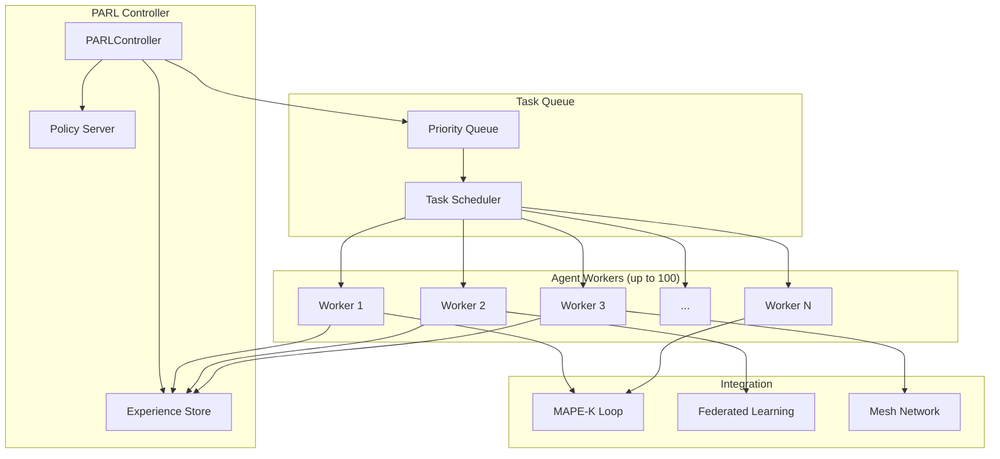

# План реализации PARL (Parallel-Agent Reinforcement Learning)

## Обзор

PARL (Parallel-Agent RL) - ключевая инновация Kimi K2.5, позволяющая выполнять до 1500 шагов параллельно с ускорением до 4.5x.

## Архитектура PARL для x0tta6bl4



## Компоненты PARL

### 1. PARLController

**Назначение:** Центральный контроллер параллельного обучения

**Ключевые функции:**
- Управление пулом агентов (до 100)
- Координация параллельных шагов (до 1500)
- Сбор и агрегация опыта
- Обновление глобальной политики

**Интерфейс:**
```python
class PARLController:
    async def initialize(self, num_workers: int = 100)
    async def submit_task(self, task: Task) -> TaskId
    async def execute_parallel(self, tasks: List[Task]) -> List[Result]
    async def update_policy(self, experiences: List[Experience])
    async def get_statistics(self) -> PARLStats
```

### 2. AgentWorker

**Назначение:** Исполнитель агентов в параллельном режиме

**Характеристики:**
- Асинхронное выполнение задач
- Локальная политика (копия глобальной)
- Сбор локального опыта
- Коммуникация с контроллером

**Интерфейс:**
```python
class AgentWorker:
    async def run(self)
    async def execute_step(self, task: Task) -> StepResult
    async def collect_experience(self) -> Experience
    async def sync_policy(self, global_policy: Policy)
```

### 3. TaskScheduler

**Назначение:** Интеллектуальное планирование задач

**Алгоритмы:**
- Priority-based scheduling
- Load balancing
- Dependency resolution
- Dynamic worker allocation

**Интерфейс:**
```python
class TaskScheduler:
    async def schedule(self, tasks: List[Task]) -> Schedule
    async def assign_to_worker(self, task: Task, worker: AgentWorker)
    async def rebalance_load(self)
    async def get_queue_stats(self) -> QueueStats
```

## Интеграция с существующими компонентами

### 1. Интеграция с Federated Learning

```python
# src/federated_learning/parl_integration.py

class PARLFederatedOrchestrator:
    """
    Интеграция PARL с Federated Learning.
    """
    
    def __init__(self):
        self.parl_controller = PARLController()
        self.fl_coordinator = FederatedCoordinator()
        
    async def parallel_training_round(self, nodes: List[str]) -> GlobalModel:
        """
        Выполнить раунд обучения с PARL.
        
        Вместо последовательного обхода нод:
        - Создаем агента для каждой ноды
        - Выполняем обучение параллельно
        - Агрегируем результаты
        """
        # Создаем задачи для каждой ноды
        tasks = [
            TrainingTask(node_id=node, model=self.global_model)
            for node in nodes
        ]
        
        # Параллельное выполнение через PARL
        results = await self.parl_controller.execute_parallel(tasks)
        
        # Агрегация через FedAvg
        return self.fl_coordinator.aggregate(results)
```

### 2. Интеграция с MAPE-K

```python
# src/core/parl_mapek_integration.py

class PARLMAPEKExecutor:
    """
    PARL-ускоренный MAPE-K executor.
    """
    
    def __init__(self):
        self.parl = PARLController()
        self.max_parallel_phases = 8
        
    async def execute_mapek_cycle(self, context: Context) -> Result:
        """
        Выполнить цикл MAPE-K с параллелизмом.
        
        Фазы, которые могут выполняться параллельно:
        - Monitor: на разных нодах
        - Analyze: разные типы аномалий
        - Plan: разные стратегии восстановления
        - Execute: независимые действия
        """
        # Phase 1: Parallel Monitoring
        monitor_tasks = [
            MonitorTask(node_id=node)
            for node in context.mesh_nodes
        ]
        monitor_results = await self.parl.execute_parallel(monitor_tasks)
        
        # Phase 2: Parallel Analysis
        analyze_tasks = [
            AnalyzeTask(monitor_result=result)
            for result in monitor_results
        ]
        analyze_results = await self.parl.execute_parallel(analyze_tasks)
        
        # Phase 3 & 4: Parallel Plan & Execute
        plan_tasks = [
            PlanTask(analysis=analysis)
            for analysis in analyze_results
        ]
        plans = await self.parl.execute_parallel(plan_tasks)
        
        execute_tasks = [
            ExecuteTask(plan=plan)
            for plan in plans
        ]
        results = await self.parl.execute_parallel(execute_tasks)
        
        return self.aggregate_results(results)
```

### 3. Интеграция с Mesh Network

```python
# src/network/parl_mesh_integration.py

class PARLMeshOptimizer:
    """
    PARL-оптимизация mesh-сети.
    """
    
    def __init__(self):
        self.parl = PARLController()
        
    async def optimize_routes_parallel(self, topology: Topology) -> RoutingTable:
        """
        Оптимизация маршрутов через PARL.
        
        Каждый агент оптимизирует маршрут для своего сегмента.
        """
        # Разбиваем топологию на сегменты
        segments = self.segment_topology(topology)
        
        # Создаем задачи оптимизации
        tasks = [
            RouteOptimizationTask(segment=segment)
            for segment in segments
        ]
        
        # Параллельная оптимизация
        segment_routes = await self.parl.execute_parallel(tasks)
        
        # Объединяем результаты
        return self.merge_routes(segment_routes)
    
    async def detect_anomalies_parallel(self, nodes: List[Node]) -> List[Anomaly]:
        """
        Параллельное обнаружение аномалий на всех нодах.
        """
        tasks = [
            AnomalyDetectionTask(node_id=node.id, metrics=node.metrics)
            for node in nodes
        ]
        
        results = await self.parl.execute_parallel(tasks)
        return [r for r in results if r.is_anomaly]
```

## Алгоритм PARL

### 1. Инициализация

```python
async def initialize_parl(self):
    """Инициализация PARL системы."""
    # Создаем пул воркеров
    self.workers = [
        AgentWorker(worker_id=i)
        for i in range(self.config.num_workers)
    ]
    
    # Запускаем воркеры
    await asyncio.gather(*[w.run() for w in self.workers])
    
    # Инициализируем глобальную политику
    self.global_policy = self.create_initial_policy()
    
    # Запускаем scheduler
    self.scheduler = TaskScheduler(self.workers)
    asyncio.create_task(self.scheduler.run())
```

### 2. Выполнение задач

```python
async def execute_parallel(self, tasks: List[Task]) -> List[Result]:
    """Параллельное выполнение задач."""
    results = []
    
    # Разбиваем на батчи по max_parallel_steps
    for batch in self.chunk_tasks(tasks, self.config.max_parallel_steps):
        # Создаем futures для батча
        futures = []
        for task in batch:
            future = asyncio.Future()
            await self.scheduler.submit(task, future)
            futures.append(future)
        
        # Ждем завершения всех задач в батче
        batch_results = await asyncio.gather(*futures)
        results.extend(batch_results)
        
        # Собираем опыт для обучения
        experiences = self.extract_experiences(batch_results)
        await self.update_policy(experiences)
    
    return results
```

### 3. Обновление политики

```python
async def update_policy(self, experiences: List[Experience]):
    """Обновление глобальной политики."""
    # Агрегируем опыт
    aggregated = self.aggregate_experiences(experiences)
    
    # Обновляем политику (PPO)
    self.global_policy = self.ppo_update(
        self.global_policy,
        aggregated
    )
    
    # Синхронизируем с воркерами
    await asyncio.gather(*[
        worker.sync_policy(self.global_policy)
        for worker in self.workers
    ])
```

## Метрики производительности

### Целевые показатели

| Метрика | Базовое значение | PARL цель | Улучшение |
|---------|------------------|-----------|-----------|
| Parallel steps | 1 | 1500 | 1500x |
| Task throughput | 100/sec | 450/sec | 4.5x |
| MAPE-K cycle time | 500ms | 110ms | 4.5x |
| FL round time | 60s | 13s | 4.5x |
| Mesh optimization | 10s | 2.2s | 4.5x |

### Мониторинг

```python
@dataclass
class PARLMetrics:
    active_workers: int
    queued_tasks: int
    completed_tasks: int
    avg_task_latency_ms: float
    throughput_tps: float
    policy_update_time_ms: float
    worker_utilization: float
```

## План реализации

### Week 1: Core PARL
- [ ] Реализовать `PARLController`
- [ ] Реализовать `AgentWorker`
- [ ] Реализовать `TaskScheduler`
- [ ] Базовые тесты

### Week 2: FL Integration
- [ ] Интеграция с `FederatedCoordinator`
- [ ] PARL-ускоренное обучение
- [ ] Тесты на синтетических данных

### Week 3: MAPE-K Integration
- [ ] Интеграция с `ParallelMAPEKExecutor`
- [ ] Параллельные фазы MAPE-K
- [ ] Chaos тестирование

### Week 4: Mesh Integration
- [ ] Интеграция с `MeshRouter`
- [ ] Параллельная оптимизация маршрутов
- [ ] Нагрузочное тестирование

### Week 5: Optimization
- [ ] Тюнинг производительности
- [ ] Достижение целевых 4.5x
- [ ] Документация

## Технические требования

### Зависимости
```
torch>=2.0.0
numpy>=1.24.0
asyncio
tensorboard  # для мониторинга
```

### Конфигурация
```yaml
parl:
  num_workers: 100
  max_parallel_steps: 1500
  batch_size: 64
  learning_rate: 3e-4
  gamma: 0.99
  gae_lambda: 0.95
  clip_epsilon: 0.2
  
  # Performance
  task_queue_size: 10000
  experience_buffer_size: 100000
  policy_update_interval: 100
```

## Заключение

PARL интеграция позволит:
1. Ускорить MAPE-K циклы в 4.5 раза
2. Параллелизовать Federated Learning
3. Оптимизировать mesh-сеть в реальном времени
4. Масштабировать до 1500 параллельных операций
