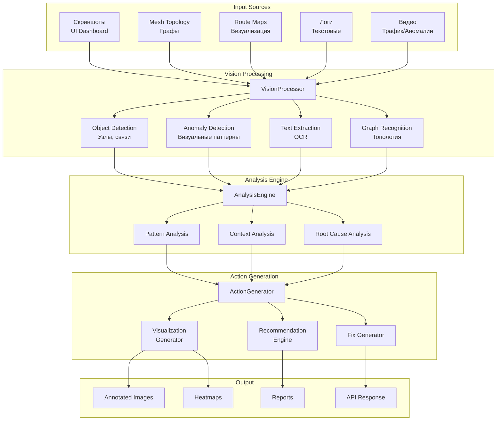

# Система визуальной отладки (Coding with Vision)

## Обзор

Интеграция возможности Kimi K2.5 "Coding with Vision" для визуальной отладки и анализа mesh-сети x0tta6bl4.

## Архитектура системы



## Компоненты системы

### 1. VisionProcessor

**Назначение:** Обработка входных визуальных данных

**Возможности:**
- Анализ скриншотов dashboard
- Распознавание mesh-топологии
- Детекция аномалий на визуальных данных
- OCR для извлечения текста из логов

**Интерфейс:**
```python
class VisionProcessor:
    async def process_image(self, image: Image, context: Context) -> VisionResult
    async def process_video(self, video: Video, context: Context) -> List[VisionResult]
    async def analyze_topology(self, topology_image: Image) -> TopologyAnalysis
    async def detect_visual_anomalies(self, image: Image) -> List[VisualAnomaly]
```

### 2. MeshTopologyAnalyzer

**Назначение:** Анализ визуальных представлений mesh-сети

**Функции:**
- Распознавание узлов и связей
- Выявление узких мест (bottlenecks)
- Анализ плотности связей
- Детекция изолированных узлов

**Пример использования:**
```python
analyzer = MeshTopologyAnalyzer()

# Анализ топологии из изображения
result = await analyzer.analyze(topology_screenshot)

# Результат
{
    "nodes_detected": 100,
    "links_detected": 450,
    "bottlenecks": [
        {
            "location": {"x": 350, "y": 200},
            "node_id": "node_015",
            "severity": "high",
            "connected_links": 25
        }
    ],
    "isolated_nodes": ["node_078"],
    "recommendations": [
        {
            "action": "add_redundant_link",
            "target": "node_015",
            "reason": "high_centrality"
        }
    ]
}
```

### 3. RouteVisualizer

**Назначение:** Визуализация и анализ маршрутов

**Возможности:**
- Наложение оптимальных маршрутов на топологию
- Визуализация latency (heatmap)
- Анимация трафика
- Детекция перегруженных маршрутов

**Пример:**
```python
visualizer = RouteVisualizer()

# Создание визуализации маршрута
viz = await visualizer.visualize_route(
    topology_image=topology,
    route=["node_001", "node_015", "node_042", "node_100"],
    metrics={"latency": 45, "bandwidth": 150}
)

# Результат - изображение с:
# - Выделенным маршрутом цветом
# - Аннотациями метрик
# - Heatmap latency
```

### 4. AnomalyVisualizer

**Назначение:** Визуальное обнаружение и представление аномалий

**Функции:**
- Выявление визуальных паттернов аномалий
- Сравнение текущего состояния с baseline
- Генерация heatmap проблемных зон
- Аннотирование скриншотов

**Пример:**
```python
anomaly_viz = AnomalyVisualizer()

# Анализ dashboard на аномалии
anomalies = await anomaly_viz.analyze_dashboard(
    screenshot=dashboard_image,
    baseline=normal_operation_image
)

# Результат
{
    "anomalies_detected": 3,
    "severity": "high",
    "annotated_image": <Image>,
    "details": [
        {
            "type": "traffic_spike",
            "location": {"x": 500, "y": 300},
            "severity": "critical",
            "confidence": 0.95
        }
    ]
}
```

### 5. SelfCorrectionEngine

**Назначение:** Автономное исправление на основе визуального анализа

**Возможности:**
- Анализ собственного графического output
- Автоматическое внесение исправлений
- Итеративная оптимизация

**Пример (BFS pathfinding как в Kimi K2.5):**
```python
# Анализ изображения лабиринта (mesh-топологии)
# и нахождение кратчайшего пути

correction_engine = SelfCorrectionEngine()

result = await correction_engine.find_optimal_path(
    maze_image=topology_image,
    start_node="node_001",
    end_node="node_100",
    algorithm="bfs"  # или A*
)

# Результат - изображение с:
# - Найденным путем (цветная траектория)
# - Длиной пути
# - Альтернативными маршрутами
```

## Интеграция с существующей системой

### 1. Интеграция с Mesh Router

```python
# src/network/vision_mesh_integration.py

class VisionMeshDebugger:
    """
    Визуальная отладка mesh-сети.
    """
    
    def __init__(self):
        self.vision = VisionProcessor()
        self.topology_analyzer = MeshTopologyAnalyzer()
        
    async def debug_topology_issues(self, mesh_state: MeshState) -> DebugResult:
        """
        Визуальная отладка проблем топологии.
        """
        # Генерируем визуализацию текущей топологии
        viz_image = await self.generate_topology_visualization(mesh_state)
        
        # Анализируем через Vision
        analysis = await self.vision.analyze_topology(viz_image)
        
        # Генерируем исправления
        fixes = await self.generate_fixes(analysis)
        
        # Применяем и проверяем
        for fix in fixes:
            await self.apply_fix(fix)
            
            # Генерируем новую визуализацию
            new_viz = await self.generate_topology_visualization(mesh_state)
            
            # Проверяем улучшение
            improvement = await self.vision.compare_visualizations(
                before=viz_image,
                after=new_viz
            )
            
            if improvement.success:
                return DebugResult(
                    fix_applied=fix,
                    improvement=improvement.metrics
                )
        
        return DebugResult(fix_applied=None)
```

### 2. Интеграция с MAPE-K

```python
# src/self_healing/vision_mapek_integration.py

class VisionMAPEKAnalyzer:
    """
    Визуальный анализ для MAPE-K цикла.
    """
    
    async def monitor_with_vision(self) -> MonitorResult:
        """
        Мониторинг через визуальный анализ dashboard.
        """
        # Делаем скриншот dashboard
        screenshot = await self.capture_dashboard()
        
        # Анализируем через Vision
        analysis = await self.vision.process_image(
            image=screenshot,
            context={"type": "dashboard", "expected_metrics": [...]}
        )
        
        # Выявляем аномалии
        anomalies = analysis.detected_anomalies
        
        return MonitorResult(anomalies=anomalies)
    
    async def analyze_with_vision(self, monitor_result: MonitorResult) -> AnalysisResult:
        """
        Анализ с визуальной поддержкой.
        """
        for anomaly in monitor_result.anomalies:
            if anomaly.has_visual_component:
                # Получаем визуальные данные
                viz_data = await self.get_visual_context(anomaly)
                
                # Анализируем
                visual_analysis = await self.vision.analyze(
                    image=viz_data,
                    context={"anomaly_type": anomaly.type}
                )
                
                # Обогащаем анализ
                anomaly.visual_evidence = visual_analysis
        
        return AnalysisResult(anomalies=monitor_result.anomalies)
```

### 3. Интеграция с RAG

```python
# src/rag/vision_rag_integration.py

class VisionRAGProcessor:
    """
    RAG с визуальным пониманием.
    """
    
    async def retrieve_with_vision(
        self,
        query: str,
        visual_context: Optional[Image] = None
    ) -> RAGResult:
        """
        Retrieval с учетом визуального контекста.
        """
        # Если есть визуальный контекст - анализируем
        if visual_context:
            vision_analysis = await self.vision.process_image(
                image=visual_context,
                context={"query": query}
            )
            
            # Обогащаем запрос
            enriched_query = f"{query}\nVisual context: {vision_analysis.description}"
        else:
            enriched_query = query
        
        # Стандартный RAG retrieval
        return await self.rag.retrieve(enriched_query)
```

## API Endpoints для Vision

### 1. Анализ изображения

**POST** `/api/v3/vision/analyze`

```multipart/form-data```

**Parameters:**
- `image` - Файл изображения
- `analysis_type` - Тип анализа
- `context` - JSON с контекстом

**Response:**
```json
{
  "analysis_id": "vis_001",
  "detected_objects": [
    {"type": "node", "id": "node_001", "bbox": [100, 100, 50, 50]},
    {"type": "link", "from": "node_001", "to": "node_002"}
  ],
  "detected_anomalies": [
    {
      "type": "high_latency",
      "location": {"x": 200, "y": 150},
      "confidence": 0.92,
      "severity": "medium"
    }
  ],
  "extracted_text": "Error: Connection timeout",
  "recommendations": [
    {
      "action": "restart_node",
      "target": "node_003",
      "confidence": 0.85
    }
  ]
}
```

### 2. Визуализация маршрута

**POST** `/api/v3/vision/visualize-route`

**Request:**
```json
{
  "topology_image": "base64_encoded_image",
  "route": ["node_001", "node_015", "node_042"],
  "metrics": {
    "latency": [10, 25, 15],
    "bandwidth": [100, 80, 120]
  },
  "visualization_type": "heatmap"
}
```

**Response:**
```json
{
  "visualization_id": "viz_001",
  "image_url": "/api/v3/vision/viz_001/image",
  "annotations": [
    {
      "type": "route",
      "path": [[100, 100], [200, 150], [300, 200]],
      "color": "#00FF00"
    },
    {
      "type": "heatmap",
      "regions": [
        {"bbox": [200, 150, 50, 50], "intensity": 0.8}
      ]
    }
  ]
}
```

### 3. Сравнение визуализаций

**POST** `/api/v3/vision/compare`

**Request:**
```json
{
  "before_image": "base64_encoded",
  "after_image": "base64_encoded",
  "comparison_type": "diff"
}
```

**Response:**
```json
{
  "comparison_id": "cmp_001",
  "differences": [
    {
      "type": "added",
      "description": "New link between node_001 and node_002",
      "bbox": [100, 100, 100, 50]
    },
    {
      "type": "removed",
      "description": "Node node_003 no longer visible",
      "bbox": [300, 200, 50, 50]
    }
  ],
  "improvement_score": 0.75,
  "regression_score": 0.1
}
```

## Use Cases

### 1. Автоматическая отладка mesh-сети

```python
async def auto_debug_mesh():
    """
    Автоматическая визуальная отладка mesh-сети.
    """
    debugger = VisionMeshDebugger()
    
    # Захватываем текущее состояние
    current_state = await capture_mesh_state()
    
    # Генерируем визуализацию
    viz = await debugger.visualize(current_state)
    
    # Анализируем
    issues = await debugger.analyze(viz)
    
    # Для каждой проблемы
    for issue in issues:
        # Генерируем исправление
        fix = await debugger.suggest_fix(issue)
        
        # Применяем
        await debugger.apply_fix(fix)
        
        # Проверяем результат
        new_viz = await debugger.visualize(await capture_mesh_state())
        comparison = await debugger.compare(viz, new_viz)
        
        if comparison.improved:
            logger.info(f"Fix applied successfully: {fix}")
        else:
            logger.warning(f"Fix did not help, rolling back: {fix}")
            await debugger.rollback(fix)
```

### 2. Визуальный анализ производительности

```python
async def analyze_performance_visually():
    """
    Анализ производительности через визуализацию.
    """
    analyzer = VisionPerformanceAnalyzer()
    
    # Собираем скриншоты dashboard за период
    screenshots = await collect_dashboard_screenshots(
        start=datetime.now() - timedelta(hours=1),
        interval=timedelta(minutes=5)
    )
    
    # Анализируем тренды
    trends = await analyzer.analyze_trends(screenshots)
    
    # Генерируем отчет с визуализациями
    report = await analyzer.generate_report(trends)
    
    return report
```

### 3. Обучение через визуальные примеры

```python
async def train_with_visual_examples():
    """
    Обучение агентов на визуальных примерах.
    """
    trainer = VisualTrainer()
    
    # Собираем примеры
    examples = [
        {"image": good_topology, "label": "optimal", "score": 1.0},
        {"image": bad_topology, "label": "suboptimal", "score": 0.3},
    ]
    
    # Обучаем vision модель
    await trainer.train(examples)
    
    # Тестируем
    test_result = await trainer.evaluate(test_topology)
    
    return test_result
```

## Технические требования

### Зависимости

```
pillow>=10.0.0
opencv-python>=4.8.0
numpy>=1.24.0
matplotlib>=3.7.0
networkx>=3.1
```

### Производительность

- Время обработки изображения: < 2 сек
- Поддерживаемые форматы: PNG, JPG, SVG
- Максимальное разрешение: 4096x4096
- Одновременные запросы: до 50

## Заключение

Система визуальной отладки позволяет:
1. Анализировать mesh-топологию через изображения
2. Автоматически обнаруживать визуальные аномалии
3. Генерировать исправления на основе визуального анализа
4. Создавать наглядные визуализации маршрутов и метрик
5. Обучать агентов на визуальных примерах
