# x0tta6bl4 Xray VPS Architecture

## System Overview

```mermaid
flowchart TB
    subgraph Internet["🌐 Internet"]
        WEB["Websites & Services"]
        CDN["CDN / Cloudflare"]
    end

    subgraph Client["👤 Client Devices"]
        FLCLASH["FlClashX / v2rayN / Nekoray"]
        BROWSERS["Browsers & Apps"]
    end

    subgraph VPS["🖥️ x0tta6bl4 VPS"]
        subgraph XRAY["Xray Core v25.1.30"]
            subgraph INBOUNDS["Inbound Protocols"]
                VLESS_R["VLESS-XTLS-Reality-Vision<br/>Port 443 (Primary)"]
                TROJAN["Trojan-XTLS-Reality<br/>Port 9443 (Fallback #1)"]
                VLESS_X["VLESS-splitHTTP<br/>Port 8443 (Fallback #2)"]
                SS["Shadowsocks 2022<br/>Port 8388 (Fallback #3)"]
                SHADOWTLS["ShadowTLS<br/>Port 8080 (Fallback #4)"]
            end

            subgraph ROUTING["Traffic Routing"]
                SNIFF["Traffic Sniffing<br/>HTTP/TLS/QUIC"]
                RULES["Routing Rules"]
                BLOCK["🚫 Block Ads & CN"]
            end

            subgraph OUTBOUNDS["Outbound Destinations"]
                DIRECT["📤 Direct"]
                WARP["☁️ WARP (Google/Netflix)"]
                BLOCKED["🚫 Blackhole"]
            end
        end

        subgraph SYSTEM["System Layer"]
            SYSCTL["TCP BBR Optimization"]
            FIREWALL["UFW/FirewallD"]
            CERTS["TLS Certificates"]
            LOGS["Logging & Monitoring"]
        end
    end

    %% Client connections
    FLCLASH -->|"VLESS + Reality<br/>XTLS Vision"| VLESS_R
    FLCLASH -->|"Trojan + Reality"| TROJAN
    FLCLASH -->|"VLESS + xHTTP"| VLESS_X
    FLCLASH -->|"SS 2022"| SS
    FLCLASH -->|"ShadowTLS"| SHADOWTLS

    %% Internal routing
    VLESS_R --> SNIFF
    TROJAN --> SNIFF
    VLESS_X --> SNIFF
    SS --> SNIFF
    SHADOWTLS --> SNIFF

    SNIFF --> RULES

    RULES -->|"Regular traffic"| DIRECT
    RULES -->|"Google/Netflix"| WARP
    RULES -->|"Ads/CN IPs"| BLOCKED

    DIRECT --> WEB
    WARP --> CDN
    CDN --> WEB
```

## Protocol Hierarchy

```mermaid
flowchart LR
    subgraph Priority["Connection Priority"]
        P1["1️⃣ VLESS-XTLS-Reality-Vision<br/>Speed: ⭐⭐⭐⭐⭐<br/>Security: ⭐⭐⭐⭐⭐<br/>Stealth: ⭐⭐⭐⭐⭐"]
        P2["2️⃣ Trojan-XTLS-Reality<br/>Speed: ⭐⭐⭐⭐⭐<br/>Security: ⭐⭐⭐⭐⭐<br/>Stealth: ⭐⭐⭐⭐"]
        P3["3️⃣ VLESS-splitHTTP<br/>Speed: ⭐⭐⭐⭐<br/>Security: ⭐⭐⭐⭐<br/>Stealth: ⭐⭐⭐⭐"]
        P4["4️⃣ Shadowsocks 2022<br/>Speed: ⭐⭐⭐⭐⭐<br/>Security: ⭐⭐⭐<br/>Stealth: ⭐⭐"]
        P5["5️⃣ ShadowTLS<br/>Speed: ⭐⭐⭐<br/>Security: ⭐⭐⭐⭐<br/>Stealth: ⭐⭐⭐⭐⭐"]
    end

    P1 -->|"Blocked?"| P2
    P2 -->|"Blocked?"| P3
    P3 -->|"Blocked?"| P4
    P4 -->|"Blocked?"| P5
```

## Data Flow Diagram

## Reality Protocol Handshake

## Network Architecture

## Failover Strategy

```mermaid
flowchart TD
    START["Client Connection Attempt"] --> TRY1{Try VLESS-Reality}
    
    TRY1 -->|Success| USE1["Use VLESS-Reality<br/>Best Performance"]
    TRY1 -->|Fail| TRY2{Try Trojan-Reality}
    
    TRY2 -->|Success| USE2["Use Trojan-Reality<br/>High Security"]
    TRY2 -->|Fail| TRY3{Try VLESS-xHTTP}
    
    TRY3 -->|Success| USE3["Use VLESS-xHTTP<br/>Fragmentation Support"]
    TRY3 -->|Fail| TRY4{Try Shadowsocks}
    
    TRY4 -->|Success| USE4["Use Shadowsocks<br/>Simple & Fast"]
    TRY4 -->|Fail| TRY5{Try ShadowTLS}
    
    TRY5 -->|Success| USE5["Use ShadowTLS<br/>Maximum Stealth"]
    TRY5 -->|Fail| ERROR["❌ All protocols failed"]

    USE1 --> MONITOR["Monitor Connection"]
    USE2 --> MONITOR
    USE3 --> MONITOR
    USE4 --> MONITOR
    USE5 --> MONITOR

    MONITOR -->|Degraded| TRY1
    MONITOR -->|Stable| MONITOR
```

## Security Layers

```mermaid
flowchart TB
    subgraph Security["Security Architecture"]
        direction TB

        S1["🔐 TLS 1.3 Encryption<br/>- AES-256-GCM<br/>- ChaCha20-Poly1305"]
        
        S2["🎭 Reality Protocol<br/>- X25519 Key Exchange<br/>- Short ID Authentication<br/>- SNI Spoofing"]
        
        S3["⚡ XTLS Vision<br/>- Zero-copy forwarding<br/>- Direct kernel bypass<br/>- Minimal overhead"]
        
        S4["🛡️ Traffic Obfuscation<br/>- Domain fronting<br/>- Packet fragmentation<br/>- Random padding"]
        
        S5["🚫 Access Control<br/>- UUID authentication<br/>- GeoIP blocking<br/>- Rate limiting"]
    end

    S1 --> S2
    S2 --> S3
    S3 --> S4
    S4 --> S5
```

## Client Compatibility Matrix

## Deployment Topology

## Monitoring & Logging

## File Structure

